# Backend Architecture Map

> **다이어그램 우선**. 각 레이어 = 큰 mermaid 1개로 한눈에. 함수 표는 `
` 안에 접혀있음 — 함수가 궁금할 때만 펼침.
>
> **분업**: 흐름 다이어그램 = [`docs/pipelines/`](../pipelines/) · 구조 지도 = 이 파일.
>
> **범례**: ✅ 검토완료 · 🟡 05 흐름도에서 옮김(스켈레톤) · ⬜ TODO · 🛡 보호로직 · ⭐ 핵심 · 🟡 이슈

---

## 🗺 한눈에 (전 레이어)

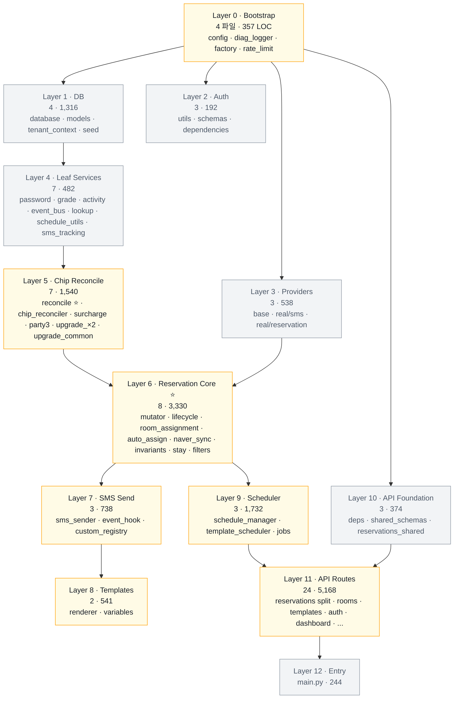
```mermaid
flowchart TB
    L0["Layer 0 · Bootstrap<br/>4 파일 · 357 LOC<br/>config · diag_logger · factory · rate_limit"]:::partial
    L1["Layer 1 · DB<br/>4 · 1,316<br/>database · models · tenant_context · seed"]:::todo
    L2["Layer 2 · Auth<br/>3 · 192<br/>utils · schemas · dependencies"]:::todo
    L3["Layer 3 · Providers<br/>3 · 538<br/>base · real/sms · real/reservation"]:::todo
    L4["Layer 4 · Leaf Services<br/>7 · 482<br/>password · grade · activity · event_bus · lookup · schedule_utils · sms_tracking"]:::todo
    L5["Layer 5 · Chip Reconcile<br/>7 · 1,540<br/>reconcile ⭐ · chip_reconciler · surcharge · party3 · upgrade_×2 · upgrade_common"]:::partial
    L6["Layer 6 · Reservation Core ⭐<br/>8 · 3,330<br/>mutator · lifecycle · room_assignment · auto_assign · naver_sync · invariants · stay · filters"]:::partial
    L7["Layer 7 · SMS Send<br/>3 · 738<br/>sms_sender · event_hook · custom_registry"]:::partial
    L8["Layer 8 · Templates<br/>2 · 541<br/>renderer · variables"]:::partial
    L9["Layer 9 · Scheduler<br/>3 · 1,732<br/>schedule_manager · template_scheduler · jobs"]:::partial
    L10["Layer 10 · API Foundation<br/>3 · 374<br/>deps · shared_schemas · reservations_shared"]:::todo
    L11["Layer 11 · API Routes<br/>24 · 5,168<br/>reservations split · rooms · templates · auth · dashboard · ..."]:::partial
    L12["Layer 12 · Entry<br/>main.py · 244"]:::todo

    L0 --> L1 & L2 & L3 & L10
    L1 --> L4
    L4 --> L5
    L5 --> L6
    L3 --> L6
    L6 --> L7 & L9
    L7 --> L8
    L9 --> L11
    L10 --> L11
    L11 --> L12

    classDef ready fill:#E8F3FF,stroke:#3182F6,color:#191F28
    classDef partial fill:#FFFBE6,stroke:#FF9F00,color:#191F28
    classDef todo fill:#F2F4F6,stroke:#8B95A1,color:#4E5968
```

---

## Layer 0 — Bootstrap

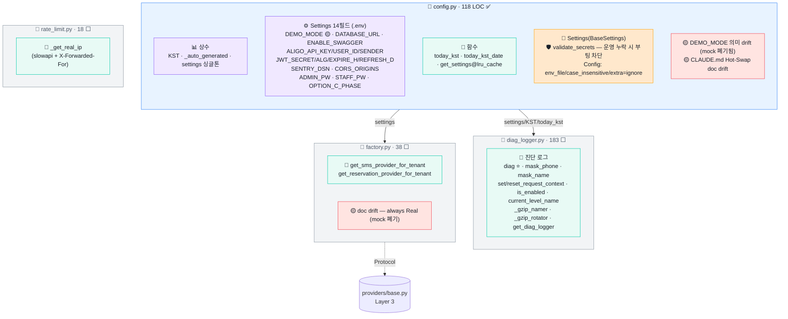
```mermaid
flowchart TB
    classDef ready fill:#E8F3FF,stroke:#3182F6,color:#191F28
    classDef todo fill:#F2F4F6,stroke:#8B95A1,color:#4E5968
    classDef data fill:#F0E8FF,stroke:#8B5CF6,color:#191F28
    classDef func fill:#E8FAF5,stroke:#00C9A7,color:#191F28
    classDef cls fill:#FFE8CC,stroke:#FF9F00,color:#191F28
    classDef issue fill:#FFE4E1,stroke:#F04452,color:#191F28

    subgraph CONFIG["📄 config.py · 118 LOC ✅"]
        direction TB
        c_const["📊 상수<br/>KST · _auto_generated · settings 싱글톤"]:::data
        c_fields["⚙️ Settings 14필드 (.env)<br/>DEMO_MODE 🟡 · DATABASE_URL · ENABLE_SWAGGER<br/>ALIGO_API_KEY/USER_ID/SENDER<br/>JWT_SECRET/ALG/EXPIRE_H/REFRESH_D<br/>SENTRY_DSN · CORS_ORIGINS<br/>ADMIN_PW · STAFF_PW · OPTION_C_PHASE"]:::data
        c_func["🔧 함수<br/>today_kst · today_kst_date · get_settings@lru_cache"]:::func
        c_cls["🧩 Settings(BaseSettings)<br/>🛡 validate_secrets — 운영 누락 시 부팅 차단<br/>Config: env_file/case_insensitive/extra=ignore"]:::cls
        c_issue["🟡 DEMO_MODE 의미 drift (mock 폐기됨)<br/>🟡 CLAUDE.md Hot-Swap doc drift"]:::issue
    end

    subgraph DIAG["📄 diag_logger.py · 183 ⬜"]
        d_func["🔧 진단 로그<br/>diag ⭐ · mask_phone · mask_name<br/>set/reset_request_context · is_enabled · current_level_name<br/>_gzip_namer · _gzip_rotator · get_diag_logger"]:::func
    end

    subgraph RATE["📄 rate_limit.py · 18 ⬜"]
        r_func["🔧 _get_real_ip<br/>(slowapi + X-Forwarded-For)"]:::func
    end

    subgraph FACT["📄 factory.py · 38 ⬜"]
        f_func["🔧 get_sms_provider_for_tenant<br/>get_reservation_provider_for_tenant"]:::func
        f_issue["🟡 doc drift — always Real (mock 폐기)"]:::issue
    end

    CONFIG -->|"settings/KST/today_kst"| DIAG
    CONFIG -->|"settings"| FACT
    FACT -.->|"Protocol"| ProvBase[("providers/base.py<br/>Layer 3")]

    class CONFIG ready
    class DIAG,RATE,FACT todo
```

📋 Layer 0 상세 표 (함수/필드 line# 포함)

#### `config.py` ✅

**모듈 상수**
| 심볼 | LINE | 값 | 용도 |
|------|------|----|----|
| `KST` | 7 | `ZoneInfo("Asia/Seoul")` | 전 프로젝트 타임존 |
| `_auto_generated` | 23 | dict | 자동생성 secret 추적 |
| `settings` | 117 | `Settings()` | import 시점 즉시 초기화 |

**`Settings` 필드**
| 필드 | 기본 | LINE | 운영 거동 |
|------|------|------|----------|
| `DEMO_MODE` | True | 30 | (스위치) 🟡 의미 drift |
| `ENABLE_SWAGGER` | None | 33 | None=DEMO 따라감 |
| `DATABASE_URL` | sqlite | 36 | postgres 필요 |
| `ALIGO_API_KEY/_USER_ID/_SENDER` | "" | 39~41 | 발송 시 필수 |
| `JWT_SECRET_KEY` | "" | 44 | **누락 시 부팅 차단** |
| `JWT_ALGORITHM` | HS256 | 45 | |
| `JWT_EXPIRE_HOURS` | 1 | 46 | access |
| `JWT_REFRESH_EXPIRE_DAYS` | 7 | 47 | refresh |
| `SENTRY_DSN` | "" | 50 | 비면 비활성 |
| `CORS_ORIGINS` | "*" | 53 | `"*"` 운영 거부 |
| `ADMIN_DEFAULT_PASSWORD` | "" | 56 | **누락 시 부팅 차단** |
| `STAFF_DEFAULT_PASSWORD` | "" | 57 | **누락 시 부팅 차단** |
| `OPTION_C_PHASE` | 0 | 64 | 0~6 단계 (현재 0) |

**함수/클래스**
| 심볼 | LINE | 비고 |
|------|------|------|
| `today_kst()` | 10 | `"YYYY-MM-DD"` |
| `today_kst_date()` | 16 | `date` 객체 |
| `get_settings()` | 111 | `@lru_cache` |
| `Settings.validate_secrets()` | 66 | `@model_validator(mode='after')` |
| `Settings.Config` | 105 | 내부 클래스 |

#### `diag_logger.py` ⬜
| 심볼 | LINE | 한줄 |
|------|------|------|
| `_gzip_namer` / `_gzip_rotator` | 42 / 48 | rotation |
| `get_diag_logger` | 63 | 싱글톤 |
| `mask_phone` / `mask_name` | 121 / 129 | PII 마스킹 |
| **`diag`** | 138 | 메인 emit |
| `set/reset_request_context` | 164 / 171 | req_id 컨텍스트 |
| `is_enabled` / `current_level_name` | 177 / 182 | 레벨 |

#### `rate_limit.py` ⬜
| 심볼 | LINE |
|------|------|
| `_get_real_ip` | 9 |

#### `factory.py` ⬜
| 심볼 | LINE |
|------|------|
| `get_sms_provider_for_tenant` | 13 |
| `get_reservation_provider_for_tenant` | 28 |

---

## Layer 1 — DB

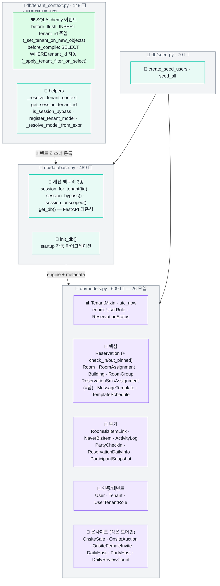
```mermaid
flowchart TB
    classDef ready fill:#E8F3FF,stroke:#3182F6,color:#191F28
    classDef todo fill:#F2F4F6,stroke:#8B95A1,color:#4E5968
    classDef data fill:#F0E8FF,stroke:#8B5CF6,color:#191F28
    classDef func fill:#E8FAF5,stroke:#00C9A7,color:#191F28
    classDef shield fill:#dcfce7,stroke:#16a34a,color:#191F28

    subgraph TC["📄 db/tenant_context.py · 148 ⬜<br/>⭐ 멀티테넌트 심장"]
        tc_func["🛡 SQLAlchemy 이벤트<br/>before_flush: INSERT tenant_id 주입 (_set_tenant_on_new_objects)<br/>before_compile: SELECT WHERE tenant_id 자동 (_apply_tenant_filter_on_select)"]:::shield
        tc_helper["🔧 helpers<br/>_resolve_tenant_context · get_session_tenant_id<br/>is_session_bypass · register_tenant_model · _resolve_model_from_expr"]:::func
    end

    subgraph DB["📄 db/database.py · 489 ⬜"]
        db_session["🔧 세션 팩토리 3종<br/>session_for_tenant(tid) · session_bypass() · session_unscoped()<br/>get_db() — FastAPI 의존성"]:::func
        db_init["🔧 init_db()<br/>startup 자동 마이그레이션"]:::func
    end

    subgraph SEED["📄 db/seed.py · 70 ⬜"]
        s_func["🔧 create_seed_users · seed_all"]:::func
    end

    subgraph MODELS["📄 db/models.py · 609 ⬜ — 26 모델"]
        m_base["📊 TenantMixin · utc_now<br/>enum: UserRole · ReservationStatus"]:::data
        m_core["🧩 핵심<br/>Reservation (+ check_in/out_pinned)<br/>Room · RoomAssignment · Building · RoomGroup<br/>ReservationSmsAssignment (=칩) · MessageTemplate · TemplateSchedule"]:::data
        m_aux["🧩 부가<br/>RoomBizItemLink · NaverBizItem · ActivityLog<br/>PartyCheckin · ReservationDailyInfo · ParticipantSnapshot"]:::data
        m_user["🧩 인증/테넌트<br/>User · Tenant · UserTenantRole"]:::data
        m_onsite["🧩 온사이트 (작은 도메인)<br/>OnsiteSale · OnsiteAuction · OnsiteFemaleInvite<br/>DailyHost · PartyHost · DailyReviewCount"]:::data
    end

    TC -.->|"이벤트 리스너 등록"| DB
    DB -->|"engine + metadata"| MODELS
    SEED --> DB
    SEED --> MODELS

    class TC,DB,SEED,MODELS todo
```

📋 Layer 1 상세 표

#### `db/tenant_context.py`
| 심볼 | LINE | 한줄 |
|------|------|------|
| `_resolve_tenant_context` | 22 | session.info → (tid, bypass) |
| `get_session_tenant_id` | 36 | tid |
| `is_session_bypass` | 45 | bypass 여부 |
| `_set_tenant_on_new_objects` | 52 | before_flush |
| `register_tenant_model` | 70 | decorator |
| `_apply_tenant_filter_on_select` | 78 | before_compile |
| `_resolve_model_from_expr` | 138 | 표현식 → 모델 |

#### `db/database.py`
| 심볼 | LINE |
|------|------|
| `session_for_tenant` | 43 |
| `session_bypass` | 62 |
| `session_unscoped` | 78 |
| `get_db` | 89 |
| `init_db` | 109 |

#### `db/seed.py`
| 심볼 | LINE |
|------|------|
| `create_seed_users` | 15 |
| `seed_all` | 48 |

#### `db/models.py` — 모델 26 종
| 모델 | LINE | TenantMixin |
|------|------|-------------|
| `Reservation` | 38 | ✅ — **check_in/out_pinned 컬럼 추가 (ded670f)** |
| `MessageTemplate` | 118 | ✅ |
| `ReservationSmsAssignment` | 158 | ✅ — assigned_by, sent_at |
| `RoomBizItemLink` | 184 | ✅ |
| `Building` | 210 | ✅ |
| `RoomGroup` | 230 | ✅ |
| `Room` | 248 | ✅ |
| `RoomAssignment` | 277 | ✅ — bed_order |
| `NaverBizItem` | 301 | ✅ |
| `TemplateSchedule` | 325 | ✅ |
| `ActivityLog` | 383 | ✅ |
| `PartyCheckin` | 400 | ✅ |
| `ReservationDailyInfo` | 416 | ✅ |
| `User` | 437 | ❌ |
| `ParticipantSnapshot` | 452 | ✅ |
| `Tenant` | 467 | ❌ |
| `UserTenantRole` | 490 | ❌ |
| `OnsiteSale` | 507 | ✅ |
| `DailyHost` | 520 | ✅ |
| `OnsiteAuction` | 534 | ✅ |
| `PartyHost` | 552 | ✅ |
| `DailyReviewCount` | 567 | ✅ |
| `OnsiteFemaleInvite` | 582 | ✅ |

---

## Layer 2 — Auth

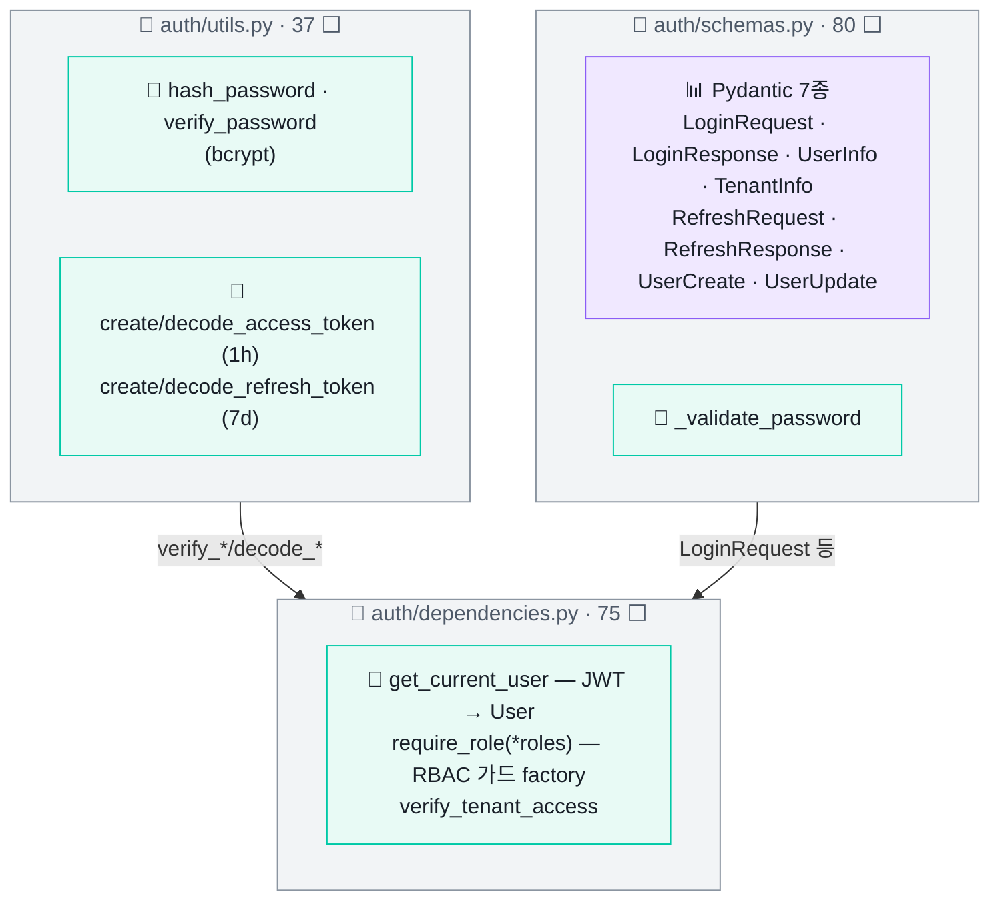
```mermaid
flowchart TB
    classDef todo fill:#F2F4F6,stroke:#8B95A1,color:#4E5968
    classDef func fill:#E8FAF5,stroke:#00C9A7,color:#191F28
    classDef data fill:#F0E8FF,stroke:#8B5CF6,color:#191F28

    subgraph UTILS["📄 auth/utils.py · 37 ⬜"]
        u_pw["🔧 hash_password · verify_password<br/>(bcrypt)"]:::func
        u_jwt["🔧 create/decode_access_token (1h)<br/>create/decode_refresh_token (7d)"]:::func
    end

    subgraph SCH["📄 auth/schemas.py · 80 ⬜"]
        s_pyd["📊 Pydantic 7종<br/>LoginRequest · LoginResponse · UserInfo · TenantInfo<br/>RefreshRequest · RefreshResponse · UserCreate · UserUpdate"]:::data
        s_func["🔧 _validate_password"]:::func
    end

    subgraph DEPS["📄 auth/dependencies.py · 75 ⬜"]
        d_func["🔧 get_current_user — JWT → User<br/>require_role(*roles) — RBAC 가드 factory<br/>verify_tenant_access"]:::func
    end

    UTILS -->|"verify_*/decode_*"| DEPS
    SCH -->|"LoginRequest 등"| DEPS

    class UTILS,SCH,DEPS todo
```

📋 Layer 2 상세 표

| 파일 | 심볼 | LINE |
|------|------|------|
| utils | hash_password | 7 |
| utils | verify_password | 11 |
| utils | create_access_token | 15 |
| utils | decode_access_token | 22 |
| utils | create_refresh_token | 26 |
| utils | decode_refresh_token | 33 |
| schemas | _validate_password | 4 |
| schemas | LoginRequest~UserUpdate | 13~68 |
| deps | get_current_user | 13 |
| deps | require_role | 42 |
| deps | verify_tenant_access | 58 |

---

## Layer 3 — Providers

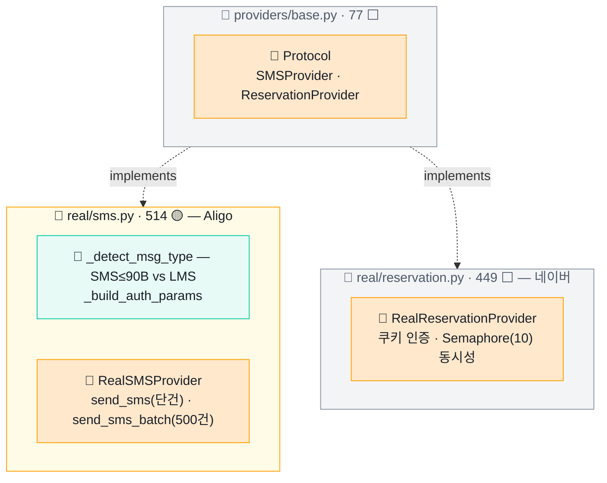
```mermaid
flowchart TB
    classDef todo fill:#F2F4F6,stroke:#8B95A1,color:#4E5968
    classDef partial fill:#FFFBE6,stroke:#FF9F00,color:#191F28
    classDef cls fill:#FFE8CC,stroke:#FF9F00,color:#191F28
    classDef func fill:#E8FAF5,stroke:#00C9A7,color:#191F28

    subgraph BASE["📄 providers/base.py · 77 ⬜"]
        b_proto["🧩 Protocol<br/>SMSProvider · ReservationProvider"]:::cls
    end

    subgraph RSMS["📄 real/sms.py · 514 🟡 — Aligo"]
        rs_func["🔧 _detect_msg_type — SMS≤90B vs LMS<br/>_build_auth_params"]:::func
        rs_cls["🧩 RealSMSProvider<br/>send_sms(단건) · send_sms_batch(500건)"]:::cls
    end

    subgraph RRES["📄 real/reservation.py · 449 ⬜ — 네이버"]
        rr_cls["🧩 RealReservationProvider<br/>쿠키 인증 · Semaphore(10) 동시성"]:::cls
    end

    BASE -.->|"implements"| RSMS
    BASE -.->|"implements"| RRES

    class BASE,RRES todo
    class RSMS partial
```

---

## Layer 4 — Leaf Services

```mermaid
flowchart TB
    classDef todo fill:#F2F4F6,stroke:#8B95A1,color:#4E5968
    classDef partial fill:#FFFBE6,stroke:#FF9F00,color:#191F28
    classDef func fill:#E8FAF5,stroke:#00C9A7,color:#191F28

    subgraph PW["📄 password_display.py · 38 ⬜"]
        pw["🔧 build_prefixed_password<br/>(한글 객실 fallback)"]:::func
    end

    subgraph GR["📄 room_grade.py · 41 ⬜"]
        gr["🔧 grade_of_room · grade_of_biz_item<br/>is_valid_grade"]:::func
    end

    subgraph AL["📄 activity_logger.py · 57 ⬜"]
        al["🔧 _get_tenant_slug<br/>log_activity (ActivityLog INSERT)"]:::func
    end

    subgraph EB["📄 event_bus.py · 56 ⬜"]
        eb["🔧 subscribe/unsubscribe/publish<br/>(테넌트별 SSE 큐)"]:::func
    end

    subgraph RL["📄 room_lookup.py · 76 ⬜"]
        rl["🔧 batch_room_lookup<br/>batch_room_number_map"]:::func
    end

    subgraph SU["📄 schedule_utils.py · 89 ⬜"]
        su["🔧 get_schedule_dates · date_range<br/>resolve_target_date (today/today+N)"]:::func
    end

    subgraph ST["📄 sms_tracking.py · 144 🟡"]
        st["🔧 _resolve_reservation_tenant<br/>record_sms_sent · record_sms_failed<br/>→ ReservationSmsAssignment.sent_at 갱신"]:::func
    end

    class PW,GR,AL,EB,RL,SU todo
    class ST partial
```

---

## Layer 5 — Chip Reconcile

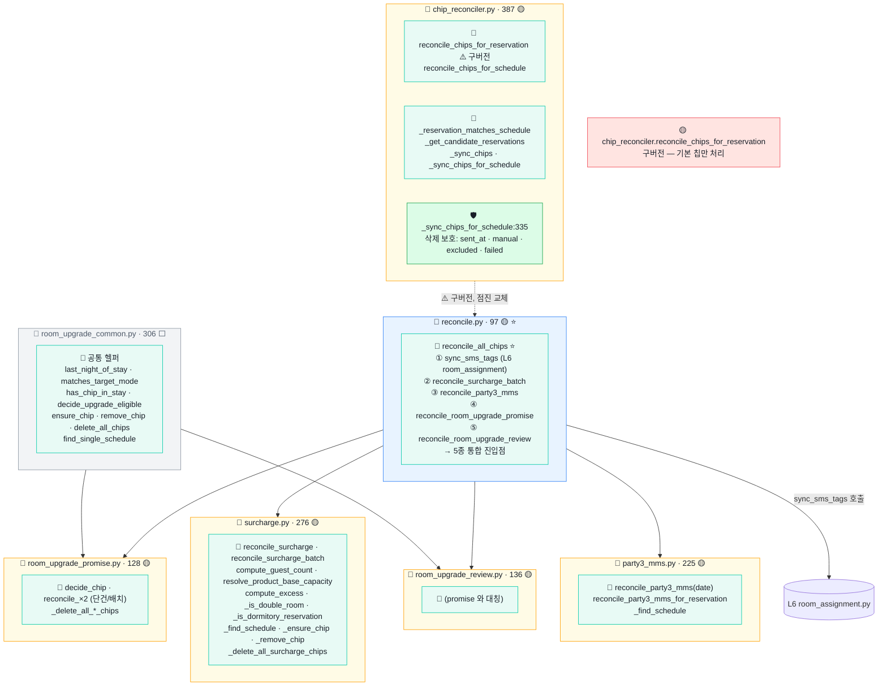
```mermaid
flowchart TB
    classDef todo fill:#F2F4F6,stroke:#8B95A1,color:#4E5968
    classDef partial fill:#FFFBE6,stroke:#FF9F00,color:#191F28
    classDef ready fill:#E8F3FF,stroke:#3182F6,color:#191F28
    classDef func fill:#E8FAF5,stroke:#00C9A7,color:#191F28
    classDef shield fill:#dcfce7,stroke:#16a34a,color:#191F28
    classDef issue fill:#FFE4E1,stroke:#F04452,color:#191F28

    subgraph RECON["📄 reconcile.py · 97 🟡 ⭐"]
        rc["🔧 reconcile_all_chips ⭐<br/>① sync_sms_tags (L6 room_assignment)<br/>② reconcile_surcharge_batch<br/>③ reconcile_party3_mms<br/>④ reconcile_room_upgrade_promise<br/>⑤ reconcile_room_upgrade_review<br/>→ 5종 통합 진입점"]:::func
    end

    subgraph CR["📄 chip_reconciler.py · 387 🟡"]
        cr_old["🔧 reconcile_chips_for_reservation ⚠️ 구버전<br/>reconcile_chips_for_schedule"]:::func
        cr_helper["🔧 _reservation_matches_schedule<br/>_get_candidate_reservations<br/>_sync_chips · _sync_chips_for_schedule"]:::func
        cr_guard["🛡 _sync_chips_for_schedule:335<br/>삭제 보호: sent_at · manual · excluded · failed"]:::shield
    end

    subgraph SC["📄 surcharge.py · 276 🟡"]
        sc_func["🔧 reconcile_surcharge · reconcile_surcharge_batch<br/>compute_guest_count · resolve_product_base_capacity<br/>compute_excess · _is_double_room · _is_dormitory_reservation<br/>_find_schedule · _ensure_chip · _remove_chip<br/>_delete_all_surcharge_chips"]:::func
    end

    subgraph P3["📄 party3_mms.py · 225 🟡"]
        p3["🔧 reconcile_party3_mms(date)<br/>reconcile_party3_mms_for_reservation<br/>_find_schedule"]:::func
    end

    subgraph RUC["📄 room_upgrade_common.py · 306 ⬜"]
        ruc["🔧 공통 헬퍼<br/>last_night_of_stay · matches_target_mode<br/>has_chip_in_stay · decide_upgrade_eligible<br/>ensure_chip · remove_chip · delete_all_chips<br/>find_single_schedule"]:::func
    end

    subgraph RUP["📄 room_upgrade_promise.py · 128 🟡"]
        rup["🔧 decide_chip · reconcile_×2 (단건/배치)<br/>_delete_all_*_chips"]:::func
    end

    subgraph RUR["📄 room_upgrade_review.py · 136 🟡"]
        rur["🔧 (promise 와 대칭)"]:::func
    end

    RECON --> SC
    RECON --> P3
    RECON --> RUP
    RECON --> RUR
    RUC --> RUP
    RUC --> RUR
    RECON -->|"sync_sms_tags 호출"| L6RA[("L6 room_assignment.py")]
    CR -.->|"⚠️ 구버전, 점진 교체"| RECON

    iss1["🟡 chip_reconciler.reconcile_chips_for_reservation<br/>구버전 — 기본 칩만 처리"]:::issue

    class RECON ready
    class CR,SC,P3,RUP,RUR partial
    class RUC todo
```

📋 Layer 5 상세 표

#### `reconcile.py` 🟡
| 심볼 | LINE |
|------|------|
| `reconcile_all_chips` | 23 |

#### `chip_reconciler.py` 🟡
| 심볼 | LINE |
|------|------|
| `reconcile_chips_for_reservation` ⚠️ 구버전 | 41 |
| `reconcile_chips_for_schedule` | 145 |
| `_reservation_matches_schedule` | 231 |
| `_get_candidate_reservations` | 243 |
| `_sync_chips` | 286 |
| `_sync_chips_for_schedule` 🛡 | 341 |

#### `surcharge.py` 🟡
| 심볼 | LINE |
|------|------|
| `_is_double_room` | 36 |
| `_is_dormitory_reservation` | 47 |
| `_find_schedule` | 68 |
| `compute_guest_count` | 76 |
| `resolve_product_base_capacity` (7b8f30c) | 85 |
| `compute_excess` | 104 |
| `reconcile_surcharge` | 111 |
| `_ensure_chip` | 189 |
| `_remove_chip` | 227 |
| `_delete_all_surcharge_chips` | 242 |
| `reconcile_surcharge_batch` | 264 |

#### `party3_mms.py` 🟡
| 심볼 | LINE |
|------|------|
| `_find_schedule` | 42 |
| `reconcile_party3_mms(date)` | 50 |
| `reconcile_party3_mms_for_reservation` | 152 |

#### `room_upgrade_common.py` ⬜
| 심볼 | LINE |
|------|------|
| `last_night_of_stay` | 35 |
| `matches_target_mode` | 51 |
| `has_chip_in_stay` | 68 |
| `decide_upgrade_eligible` | 86 |
| `ensure_chip` | 165 |
| `remove_chip` | 221 |
| `delete_all_chips` | 251 |
| `find_single_schedule` | 290 |

#### `room_upgrade_promise.py` 🟡
| 심볼 | LINE |
|------|------|
| `decide_chip` | 38 |
| `reconcile_room_upgrade_promise` | 47 |
| `reconcile_room_upgrade_promise_batch` | 97 |
| `_delete_all_room_upgrade_promise_chips` | 118 |

#### `room_upgrade_review.py` 🟡 (promise 와 대칭)

---

## Layer 6 — Reservation Core ⭐

### 6A. Mutator + Lifecycle 두 게이트웨이 (ded670f 신규)

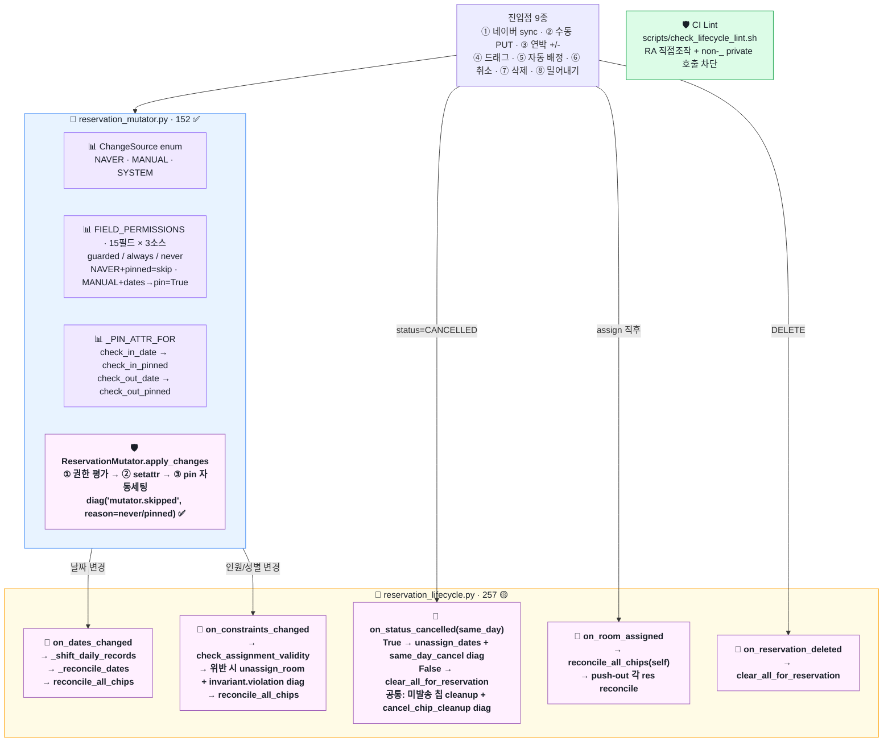
```mermaid
flowchart TB
    classDef ready fill:#E8F3FF,stroke:#3182F6,color:#191F28
    classDef partial fill:#FFFBE6,stroke:#FF9F00,color:#191F28
    classDef gate fill:#FFF0FF,stroke:#9B59B6,color:#191F28,font-weight:bold
    classDef data fill:#F0E8FF,stroke:#8B5CF6,color:#191F28
    classDef shield fill:#dcfce7,stroke:#16a34a,color:#191F28
    classDef func fill:#E8FAF5,stroke:#00C9A7,color:#191F28

    subgraph MUT["📄 reservation_mutator.py · 152 ✅"]
        m_enum["📊 ChangeSource enum<br/>NAVER · MANUAL · SYSTEM"]:::data
        m_table["📊 FIELD_PERMISSIONS · 15필드 × 3소스<br/>guarded / always / never<br/>NAVER+pinned=skip · MANUAL+dates→pin=True"]:::data
        m_pin["📊 _PIN_ATTR_FOR<br/>check_in_date → check_in_pinned<br/>check_out_date → check_out_pinned"]:::data
        m_func["🛡 ReservationMutator.apply_changes<br/>① 권한 평가 → ② setattr → ③ pin 자동세팅<br/>diag('mutator.skipped', reason=never/pinned) ✅"]:::gate
    end

    subgraph LC["📄 reservation_lifecycle.py · 257 🟡"]
        lc1["🔧 on_dates_changed<br/>→ _shift_daily_records<br/>→ _reconcile_dates<br/>→ reconcile_all_chips"]:::gate
        lc2["🔧 on_constraints_changed<br/>→ check_assignment_validity<br/>→ 위반 시 unassign_room + invariant.violation diag<br/>→ reconcile_all_chips"]:::gate
        lc3["🔧 on_status_cancelled(same_day)<br/>True → unassign_dates + same_day_cancel diag<br/>False → clear_all_for_reservation<br/>공통: 미발송 칩 cleanup + cancel_chip_cleanup diag"]:::gate
        lc4["🔧 on_room_assigned<br/>→ reconcile_all_chips(self)<br/>→ push-out 각 res reconcile"]:::gate
        lc5["🔧 on_reservation_deleted<br/>→ clear_all_for_reservation"]:::gate
    end

    Entry9["진입점 9종<br/>① 네이버 sync · ② 수동 PUT · ③ 연박 +/-<br/>④ 드래그 · ⑤ 자동 배정 · ⑥ 취소 · ⑦ 삭제 · ⑧ 밀어내기"] --> MUT
    MUT -->|"날짜 변경"| lc1
    MUT -->|"인원/성별 변경"| lc2
    Entry9 -->|"status=CANCELLED"| lc3
    Entry9 -->|"assign 직후"| lc4
    Entry9 -->|"DELETE"| lc5

    Lint["🛡 CI Lint<br/>scripts/check_lifecycle_lint.sh<br/>RA 직접조작 + non-_ private 호출 차단"]:::shield

    class MUT ready
    class LC partial
```

### 6B. 후처리 함수 + 자동배정 + 네이버 동기화

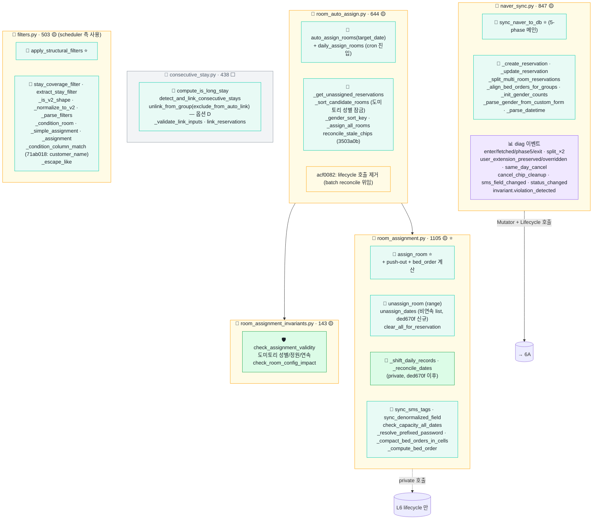
```mermaid
flowchart TB
    classDef partial fill:#FFFBE6,stroke:#FF9F00,color:#191F28
    classDef todo fill:#F2F4F6,stroke:#8B95A1,color:#4E5968
    classDef func fill:#E8FAF5,stroke:#00C9A7,color:#191F28
    classDef shield fill:#dcfce7,stroke:#16a34a,color:#191F28
    classDef data fill:#F0E8FF,stroke:#8B5CF6,color:#191F28
    classDef warn fill:#FFFBE6,stroke:#FF9F00,color:#191F28

    subgraph RA["📄 room_assignment.py · 1105 🟡 ⭐"]
        ra_main["🔧 assign_room ⭐<br/>+ push-out + bed_order 계산"]:::func
        ra_unassign["🔧 unassign_room (range)<br/>unassign_dates (비연속 list, ded670f 신규)<br/>clear_all_for_reservation"]:::func
        ra_priv["🔧 _shift_daily_records · _reconcile_dates<br/>(private, ded670f 이후)"]:::shield
        ra_help["🔧 sync_sms_tags · sync_denormalized_field<br/>check_capacity_all_dates<br/>_resolve_prefixed_password · _compact_bed_orders_in_cells<br/>_compute_bed_order"]:::func
    end

    subgraph INV["📄 room_assignment_invariants.py · 143 🟡"]
        inv["🛡 check_assignment_validity<br/>도미토리 성별/정원/연속<br/>check_room_config_impact"]:::shield
    end

    subgraph AA["📄 room_auto_assign.py · 644 🟡"]
        aa_main["🔧 auto_assign_rooms(target_date)<br/>+ daily_assign_rooms (cron 진입)"]:::func
        aa_help["🔧 _get_unassigned_reservations<br/>_sort_candidate_rooms (도미토리 성별 잠금)<br/>_gender_sort_key · _assign_all_rooms<br/>reconcile_stale_chips (3503a0b)"]:::func
        aa_note["acf0082: lifecycle 호출 제거 (batch reconcile 위임)"]:::warn
    end

    subgraph NS["📄 naver_sync.py · 847 🟡"]
        ns_main["🔧 sync_naver_to_db ⭐ (5-phase 메인)"]:::func
        ns_helper["🔧 _create_reservation · _update_reservation<br/>_split_multi_room_reservations<br/>_align_bed_orders_for_groups · _init_gender_counts<br/>_parse_gender_from_custom_form · _parse_datetime"]:::func
        ns_diag["📊 diag 이벤트<br/>enter/fetched/phase5/exit · split_×2<br/>user_extension_preserved/overridden · same_day_cancel<br/>cancel_chip_cleanup · sms_field_changed · status_changed<br/>invariant.violation_detected"]:::data
    end

    subgraph CS["📄 consecutive_stay.py · 438 ⬜"]
        cs["🔧 compute_is_long_stay<br/>detect_and_link_consecutive_stays<br/>unlink_from_group(exclude_from_auto_link) — 옵션 D<br/>_validate_link_inputs · link_reservations"]:::func
    end

    subgraph FT["📄 filters.py · 503 🟡 (scheduler 측 사용)"]
        ft_main["🔧 apply_structural_filters ⭐"]:::func
        ft_help["🔧 stay_coverage_filter · extract_stay_filter<br/>_is_v2_shape · _normalize_to_v2 · _parse_filters<br/>_condition_room · _simple_assignment · _assignment<br/>_condition_column_match (71ab018: customer_name)<br/>_escape_like"]:::func
    end

    NS -->|"Mutator + Lifecycle 호출"| MUT_LC[("→ 6A")]
    AA --> RA
    AA --> INV
    RA -.->|"private 호출"| LC2[("L6 lifecycle 만")]

    class RA,AA,NS,FT,INV partial
    class CS todo
```

📋 Layer 6 상세 표

#### `reservation_mutator.py` ✅
- `ChangeSource` enum (L22): NAVER/MANUAL/SYSTEM
- `FIELD_PERMISSIONS` (L37): 15 필드 권한표
- `_PIN_ATTR_FOR` (L59): date→pin 컬럼 매핑
- `ReservationMutator.apply_changes` (L78): 메인 진입

#### `reservation_lifecycle.py` 🟡
| 심볼 | LINE |
|------|------|
| `on_dates_changed` | 25 |
| `on_constraints_changed` | 53 |
| `on_status_cancelled` | 123 |
| `on_room_assigned` | 194 |
| `on_reservation_deleted` | 223 |

#### `room_assignment_invariants.py` 🟡
| 심볼 | LINE |
|------|------|
| `check_assignment_validity` | 20 |
| `check_room_config_impact` | 126 |

#### `room_assignment.py` 🟡
| 심볼 | LINE |
|------|------|
| `_resolve_prefixed_password` | 23 |
| `_compact_bed_orders_in_cells` | 76 |
| `_compute_bed_order` | 135 |
| `sync_sms_tags` | 198 |
| **`assign_room`** | 213 |
| `unassign_room` | 569 |
| **`unassign_dates`** (ded670f) | 668 |
| `clear_all_for_reservation` | 736 |
| `sync_denormalized_field` | 777 |
| `_shift_daily_records` (private) | 809 |
| `_reconcile_dates` (private) | 894 |
| `check_capacity_all_dates` | 1044 |

#### `room_auto_assign.py` 🟡
| 심볼 | LINE |
|------|------|
| `auto_assign_rooms` | 32 |
| `_get_unassigned_reservations` | 212 |
| `_sort_candidate_rooms` | 250 |
| `_gender_sort_key` | 264 |
| `_assign_all_rooms` | 272 |
| `reconcile_stale_chips` (3503a0b) | 473 |
| `daily_assign_rooms` | 602 |

#### `naver_sync.py` 🟡
| 심볼 | LINE |
|------|------|
| `_parse_gender_from_custom_form` | 24 |
| `_parse_datetime` | 41 |
| **`sync_naver_to_db`** | 51 |
| `_align_bed_orders_for_groups` | 394 |
| `_init_gender_counts` | 472 |
| `_split_multi_room_reservations` | 492 |
| `_create_reservation` | 594 |
| `_update_reservation` | 646 |

#### `consecutive_stay.py` ⬜
| 심볼 | LINE |
|------|------|
| `compute_is_long_stay` | 28 |
| `detect_and_link_consecutive_stays` | 48 |
| `unlink_from_group` | 246 |
| `_validate_link_inputs` | 315 |
| `link_reservations` | 363 |

#### `filters.py` 🟡
| 심볼 | LINE |
|------|------|
| `stay_coverage_filter` | 56 |
| `_is_v2_shape` / `_normalize_to_v2` / `_parse_filters` | 85 / 105 / 198 |
| `extract_stay_filter` | 224 |
| `_condition_room` | 257 |
| `_condition_simple_assignment` | 290 |
| `_condition_assignment` | 315 |
| `_escape_like` | 322 |
| `_condition_column_match` | 327 |
| **`apply_structural_filters`** | 441 |

---

## Layer 7 — SMS Send

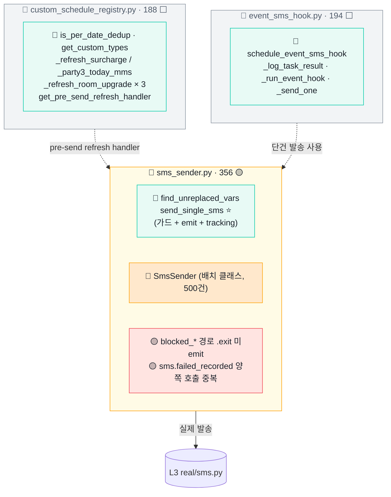
```mermaid
flowchart TB
    classDef todo fill:#F2F4F6,stroke:#8B95A1,color:#4E5968
    classDef partial fill:#FFFBE6,stroke:#FF9F00,color:#191F28
    classDef func fill:#E8FAF5,stroke:#00C9A7,color:#191F28
    classDef cls fill:#FFE8CC,stroke:#FF9F00,color:#191F28
    classDef issue fill:#FFE4E1,stroke:#F04452,color:#191F28

    subgraph CSR["📄 custom_schedule_registry.py · 188 ⬜"]
        csr["🔧 is_per_date_dedup · get_custom_types<br/>_refresh_surcharge / _party3_today_mms<br/>_refresh_room_upgrade × 3<br/>get_pre_send_refresh_handler"]:::func
    end

    subgraph SMSSEND["📄 sms_sender.py · 356 🟡"]
        ss_func["🔧 find_unreplaced_vars<br/>send_single_sms ⭐<br/>(가드 + emit + tracking)"]:::func
        ss_cls["🧩 SmsSender (배치 클래스, 500건)"]:::cls
        ss_iss["🟡 blocked_* 경로 .exit 미emit<br/>🟡 sms.failed_recorded 양쪽 호출 중복"]:::issue
    end

    subgraph HOOK["📄 event_sms_hook.py · 194 ⬜"]
        hook["🔧 schedule_event_sms_hook<br/>_log_task_result · _run_event_hook · _send_one"]:::func
    end

    CSR -.->|"pre-send refresh handler"| SMSSEND
    SMSSEND -->|"실제 발송"| L3SMS[("L3 real/sms.py")]
    HOOK -.->|"단건 발송 사용"| SMSSEND

    class CSR,HOOK todo
    class SMSSEND partial
```

---

## Layer 8 — Templates

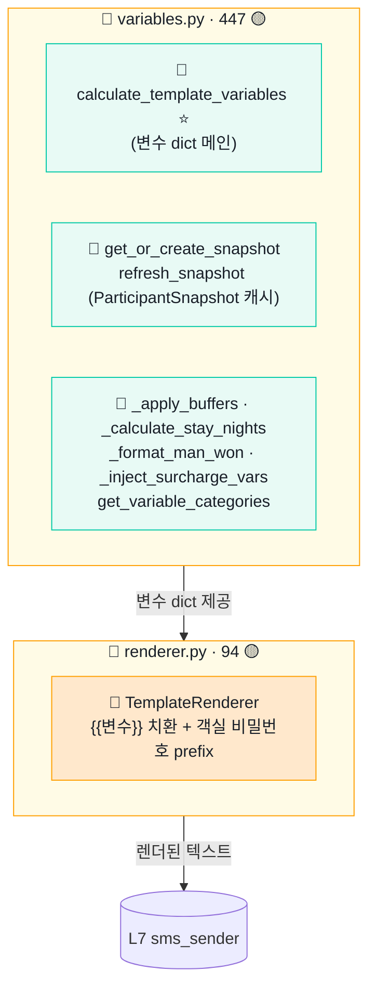
```mermaid
flowchart TB
    classDef partial fill:#FFFBE6,stroke:#FF9F00,color:#191F28
    classDef func fill:#E8FAF5,stroke:#00C9A7,color:#191F28
    classDef cls fill:#FFE8CC,stroke:#FF9F00,color:#191F28

    subgraph REND["📄 renderer.py · 94 🟡"]
        rd_cls["🧩 TemplateRenderer<br/>{{변수}} 치환 + 객실 비밀번호 prefix"]:::cls
    end

    subgraph VAR["📄 variables.py · 447 🟡"]
        v_main["🔧 calculate_template_variables ⭐<br/>(변수 dict 메인)"]:::func
        v_snap["🔧 get_or_create_snapshot<br/>refresh_snapshot (ParticipantSnapshot 캐시)"]:::func
        v_help["🔧 _apply_buffers · _calculate_stay_nights<br/>_format_man_won · _inject_surcharge_vars<br/>get_variable_categories"]:::func
    end

    VAR -->|"변수 dict 제공"| REND
    REND -->|"렌더된 텍스트"| L7Send[("L7 sms_sender")]

    class REND,VAR partial
```

---

## Layer 9 — Scheduler

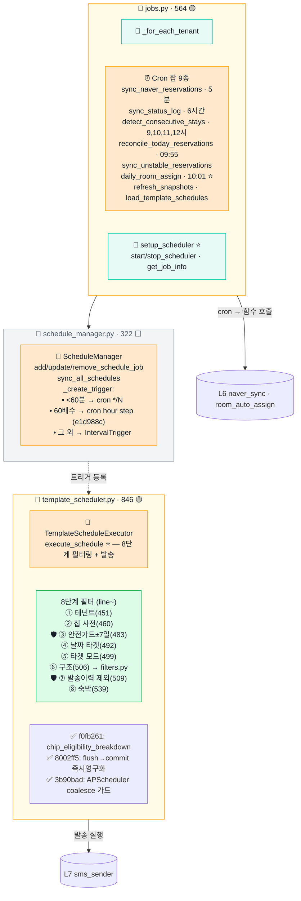
```mermaid
flowchart TB
    classDef todo fill:#F2F4F6,stroke:#8B95A1,color:#4E5968
    classDef partial fill:#FFFBE6,stroke:#FF9F00,color:#191F28
    classDef func fill:#E8FAF5,stroke:#00C9A7,color:#191F28
    classDef cls fill:#FFE8CC,stroke:#FF9F00,color:#191F28
    classDef shield fill:#dcfce7,stroke:#16a34a,color:#191F28
    classDef cron fill:#FFE8CC,stroke:#FF9F00,color:#191F28

    subgraph SM["📄 schedule_manager.py · 322 ⬜"]
        sm["🧩 ScheduleManager<br/>add/update/remove_schedule_job<br/>sync_all_schedules<br/>_create_trigger:<br/>　• <60분 → cron */N<br/>　• 60배수 → cron hour step (e1d988c)<br/>　• 그 외 → IntervalTrigger"]:::cls
    end

    subgraph TS["📄 template_scheduler.py · 846 🟡"]
        ts_exec["🧩 TemplateScheduleExecutor<br/>execute_schedule ⭐ — 8단계 필터링 + 발송"]:::cls
        ts_filter["8단계 필터 (line~)<br/>① 테넌트(451)<br/>② 칩 사전(460)<br/>🛡 ③ 안전가드±7일(483)<br/>④ 날짜 타겟(492)<br/>⑤ 타겟 모드(499)<br/>⑥ 구조(506) → filters.py<br/>🛡 ⑦ 발송이력 제외(509)<br/>⑧ 숙박(539)"]:::shield
        ts_recent["✅ f0fb261: chip_eligibility_breakdown<br/>✅ 8002ff5: flush→commit 즉시영구화<br/>✅ 3b90bad: APScheduler coalesce 가드"]
    end

    subgraph JB["📄 jobs.py · 564 🟡"]
        jb_helper["🔧 _for_each_tenant"]:::func
        jb_cron["⏰ Cron 잡 9종<br/>sync_naver_reservations · 5분<br/>sync_status_log · 6시간<br/>detect_consecutive_stays · 9,10,11,12시<br/>reconcile_today_reservations · 09:55<br/>sync_unstable_reservations<br/>daily_room_assign · 10:01 ⭐<br/>refresh_snapshots · load_template_schedules"]:::cron
        jb_ctrl["🔧 setup_scheduler ⭐<br/>start/stop_scheduler · get_job_info"]:::func
    end

    SM -.->|"트리거 등록"| TS
    JB --> SM
    TS -->|"발송 실행"| L7Send[("L7 sms_sender")]
    JB -->|"cron → 함수 호출"| L6NS[("L6 naver_sync · room_auto_assign")]

    class TS,JB partial
    class SM todo
```

---

## Layer 10 — API Foundation

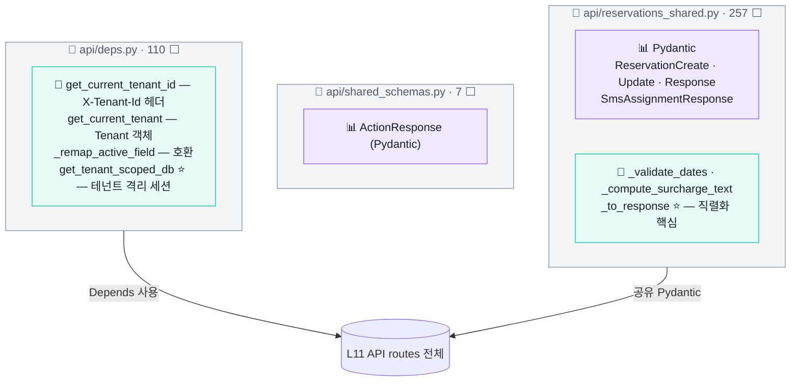
```mermaid
flowchart TB
    classDef todo fill:#F2F4F6,stroke:#8B95A1,color:#4E5968
    classDef func fill:#E8FAF5,stroke:#00C9A7,color:#191F28
    classDef data fill:#F0E8FF,stroke:#8B5CF6,color:#191F28

    subgraph DPS["📄 api/deps.py · 110 ⬜"]
        dps["🔧 get_current_tenant_id — X-Tenant-Id 헤더<br/>get_current_tenant — Tenant 객체<br/>_remap_active_field — 호환<br/>get_tenant_scoped_db ⭐ — 테넌트 격리 세션"]:::func
    end

    subgraph SHD["📄 api/shared_schemas.py · 7 ⬜"]
        shd["📊 ActionResponse (Pydantic)"]:::data
    end

    subgraph RSH["📄 api/reservations_shared.py · 257 ⬜"]
        rsh_pyd["📊 Pydantic<br/>ReservationCreate · Update · Response<br/>SmsAssignmentResponse"]:::data
        rsh_func["🔧 _validate_dates · _compute_surcharge_text<br/>_to_response ⭐ — 직렬화 핵심"]:::func
    end

    DPS -->|"Depends 사용"| L11[("L11 API routes 전체")]
    RSH -->|"공유 Pydantic"| L11

    class DPS,SHD,RSH todo
```

---

## Layer 11 — API Routes (24 파일)

### 11A. 조회/단순 (5 파일)

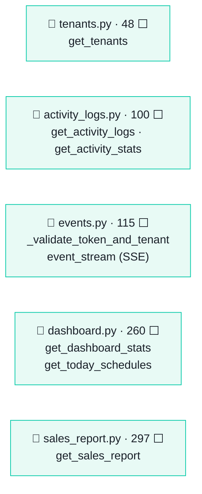
```mermaid
flowchart LR
    classDef todo fill:#F2F4F6,stroke:#8B95A1,color:#4E5968
    classDef func fill:#E8FAF5,stroke:#00C9A7,color:#191F28

    A1["📄 tenants.py · 48 ⬜<br/>get_tenants"]:::func
    A2["📄 activity_logs.py · 100 ⬜<br/>get_activity_logs · get_activity_stats"]:::func
    A3["📄 events.py · 115 ⬜<br/>_validate_token_and_tenant<br/>event_stream (SSE)"]:::func
    A4["📄 dashboard.py · 260 ⬜<br/>get_dashboard_stats<br/>get_today_schedules"]:::func
    A5["📄 sales_report.py · 297 ⬜<br/>get_sales_report"]:::func
```

### 11B. 설정/운영 (3 파일)

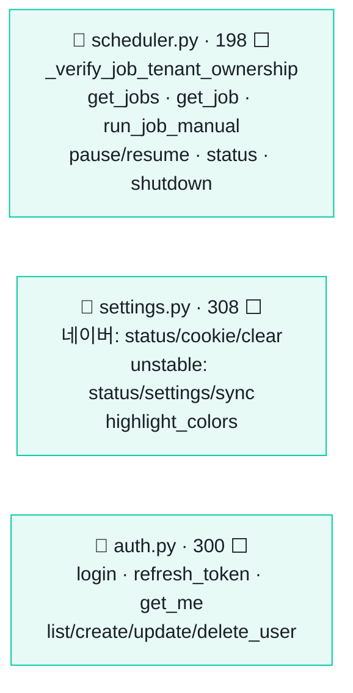
```mermaid
flowchart LR
    classDef todo fill:#F2F4F6,stroke:#8B95A1,color:#4E5968
    classDef func fill:#E8FAF5,stroke:#00C9A7,color:#191F28

    B1["📄 scheduler.py · 198 ⬜<br/>_verify_job_tenant_ownership<br/>get_jobs · get_job · run_job_manual<br/>pause/resume · status · shutdown"]:::func
    B2["📄 settings.py · 308 ⬜<br/>네이버: status/cookie/clear<br/>unstable: status/settings/sync<br/>highlight_colors"]:::func
    B3["📄 auth.py · 300 ⬜<br/>login · refresh_token · get_me<br/>list/create/update/delete_user"]:::func
```

### 11C. 작은 도메인 CRUD (8 파일)

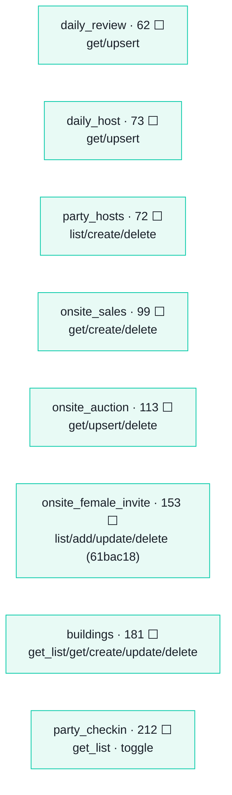
```mermaid
flowchart LR
    classDef todo fill:#F2F4F6,stroke:#8B95A1,color:#4E5968
    classDef func fill:#E8FAF5,stroke:#00C9A7,color:#191F28

    C1["daily_review · 62 ⬜<br/>get/upsert"]:::func
    C2["daily_host · 73 ⬜<br/>get/upsert"]:::func
    C3["party_hosts · 72 ⬜<br/>list/create/delete"]:::func
    C4["onsite_sales · 99 ⬜<br/>get/create/delete"]:::func
    C5["onsite_auction · 113 ⬜<br/>get/upsert/delete"]:::func
    C6["onsite_female_invite · 153 ⬜<br/>list/add/update/delete (61bac18)"]:::func
    C7["buildings · 181 ⬜<br/>get_list/get/create/update/delete"]:::func
    C8["party_checkin · 212 ⬜<br/>get_list · toggle"]:::func
```

### 11D. 메시징 / 템플릿 (2 파일)

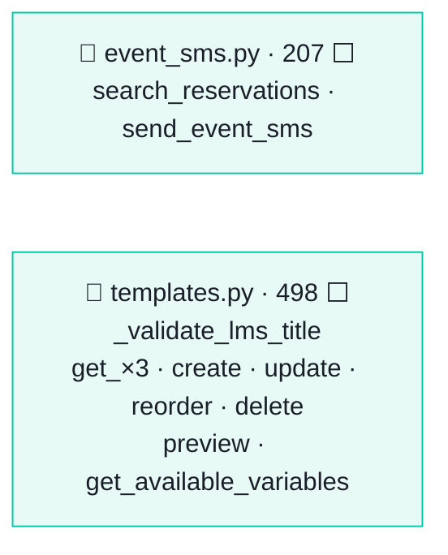
```mermaid
flowchart LR
    classDef todo fill:#F2F4F6,stroke:#8B95A1,color:#4E5968
    classDef func fill:#E8FAF5,stroke:#00C9A7,color:#191F28

    D1["📄 event_sms.py · 207 ⬜<br/>search_reservations · send_event_sms"]:::func
    D2["📄 templates.py · 498 ⬜<br/>_validate_lms_title<br/>get_×3 · create · update · reorder · delete<br/>preview · get_available_variables"]:::func
```

### 11E. 객실/스케줄 (2 파일)

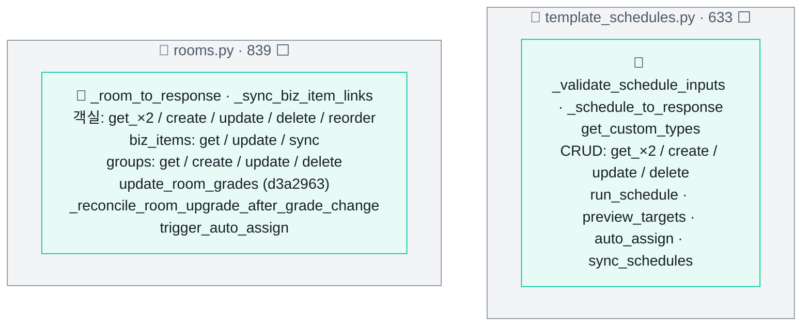
```mermaid
flowchart TB
    classDef todo fill:#F2F4F6,stroke:#8B95A1,color:#4E5968
    classDef func fill:#E8FAF5,stroke:#00C9A7,color:#191F28

    subgraph TS["📄 template_schedules.py · 633 ⬜"]
        ts["🔧 _validate_schedule_inputs · _schedule_to_response<br/>get_custom_types<br/>CRUD: get_×2 / create / update / delete<br/>run_schedule · preview_targets · auto_assign · sync_schedules"]:::func
    end

    subgraph RM["📄 rooms.py · 839 ⬜"]
        rm["🔧 _room_to_response · _sync_biz_item_links<br/>객실: get_×2 / create / update / delete / reorder<br/>biz_items: get / update / sync<br/>groups: get / create / update / delete<br/>update_room_grades (d3a2963)<br/>_reconcile_room_upgrade_after_grade_change<br/>trigger_auto_assign"]:::func
    end

    class TS,RM todo
```

### 11F. 예약 4-way split (ded670f 이후) ⭐

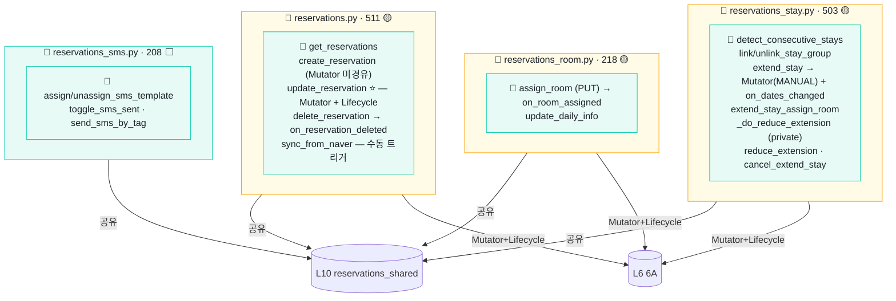
```mermaid
flowchart TB
    classDef partial fill:#FFFBE6,stroke:#FF9F00,color:#191F28
    classDef func fill:#E8FAF5,stroke:#00C9A7,color:#191F28

    subgraph RS["📄 reservations.py · 511 🟡"]
        rs["🔧 get_reservations<br/>create_reservation (Mutator 미경유)<br/>update_reservation ⭐ — Mutator + Lifecycle<br/>delete_reservation → on_reservation_deleted<br/>sync_from_naver — 수동 트리거"]:::func
    end

    subgraph RSR["📄 reservations_room.py · 218 🟡"]
        rsr["🔧 assign_room (PUT) → on_room_assigned<br/>update_daily_info"]:::func
    end

    subgraph RSS["📄 reservations_sms.py · 208 ⬜"]
        rss["🔧 assign/unassign_sms_template<br/>toggle_sms_sent · send_sms_by_tag"]:::func
    end

    subgraph RST["📄 reservations_stay.py · 503 🟡"]
        rst["🔧 detect_consecutive_stays<br/>link/unlink_stay_group<br/>extend_stay → Mutator(MANUAL) + on_dates_changed<br/>extend_stay_assign_room<br/>_do_reduce_extension (private)<br/>reduce_extension · cancel_extend_stay"]:::func
    end

    RS & RSR & RSS & RST -->|"공유"| L10RSH[("L10 reservations_shared")]
    RS & RSR & RST -->|"Mutator+Lifecycle"| L6MUTLC[("L6 6A")]

    class RS,RSR,RST partial
    class RSS func
```

---

## Layer 12 — Entry

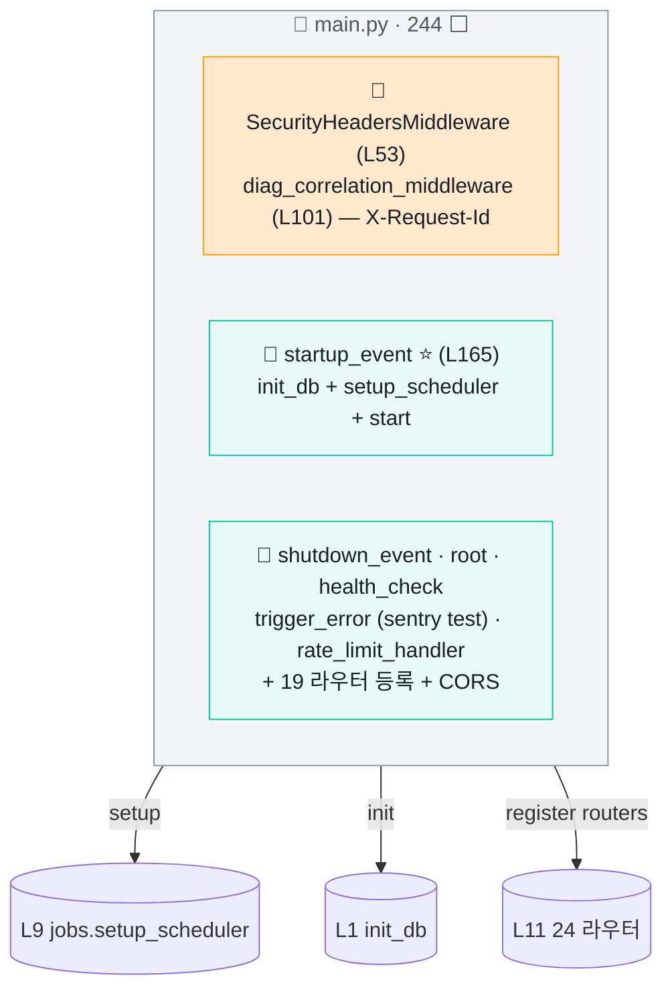
```mermaid
flowchart TB
    classDef todo fill:#F2F4F6,stroke:#8B95A1,color:#4E5968
    classDef cls fill:#FFE8CC,stroke:#FF9F00,color:#191F28
    classDef func fill:#E8FAF5,stroke:#00C9A7,color:#191F28

    subgraph MAIN["📄 main.py · 244 ⬜"]
        m_mid["🧩 SecurityHeadersMiddleware (L53)<br/>diag_correlation_middleware (L101) — X-Request-Id"]:::cls
        m_start["🔧 startup_event ⭐ (L165)<br/>init_db + setup_scheduler + start"]:::func
        m_other["🔧 shutdown_event · root · health_check<br/>trigger_error (sentry test) · rate_limit_handler<br/>+ 19 라우터 등록 + CORS"]:::func
    end

    MAIN -->|"setup"| L9JB[("L9 jobs.setup_scheduler")]
    MAIN -->|"init"| L1DB[("L1 init_db")]
    MAIN -->|"register routers"| L11[("L11 24 라우터")]

    class MAIN todo
```

---

## 🚨 이슈 트래커 (전체)

```mermaid
flowchart LR
    classDef issue fill:#FFE4E1,stroke:#F04452,color:#191F28
    classDef done fill:#dcfce7,stroke:#16a34a,color:#191F28

    I01["I-01 · config.DEMO_MODE<br/>의미 drift, ENVIRONMENT 리네임 검토"]:::issue
    I02["I-02 · factory + CLAUDE.md<br/>Hot-Swap doc drift (mock 폐기)"]:::issue
    I03["I-03 · sms_sender.send_single_sms<br/>blocked_* 경로 .exit 미emit"]:::issue
    I04["I-04 · sms_sender + template_scheduler<br/>sms.failed_recorded 중복"]:::issue
    I05["I-05 · chip_reconciler 구버전<br/>reconcile_chips_for_reservation"]:::issue
    I06["I-06 · naver_sync.user_extension_overridden<br/>acf0082 후 발화 경로 변경"]:::issue
    DONE1["✅ mutator.skipped diag 추가 (2026-05-15)"]:::done
    DONE2["✅ unassign_dates 신규 (ded670f)"]:::done
    DONE3["✅ _shift_daily/_reconcile_dates private 화"]:::done
```

---

## 갱신 규칙

1. **다이어그램 우선** — 새 파일은 mermaid 노드로 먼저 추가
2. **표는 `
` 안에** — 디테일 확인 필요 시만 펼침
3. **🟡 → ✅ 승격** — 실제 코드 readthrough + 4 섹션 검증 후
4. **🚨 이슈 발견 시** — 다이어그램에 빨간 노드 + 트래커에도 등록
5. **line# 시프트 시** — grep 재확인 후 일괄 갱신
