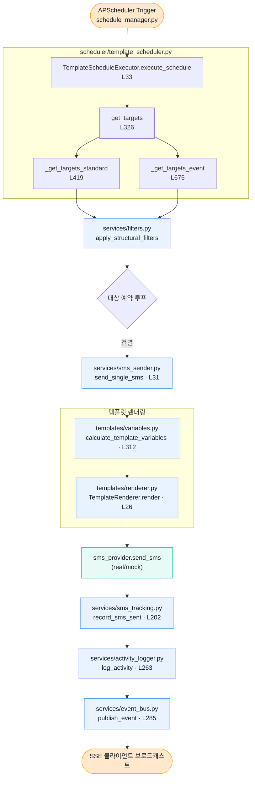

# 1. SMS Template Schedule 파이프라인

`TemplateSchedule` DB 레코드가 APScheduler에 등록되어 있다가, 트리거 시점이 되면 대상 예약을 필터링하고 템플릿을 렌더링한 뒤 SMS를 발송하는 흐름입니다.

## Mermaid 흐름도

## 진입점

- **자동 트리거**: `TemplateSchedule` 레코드 → `scheduler/schedule_manager.py`가 APScheduler에 cron 잡으로 등록
- **수동 트리거**: `api/template_schedules.py`의 수동 실행 엔드포인트 (`manual=True`)

## 핵심 함수

| 단계 | 함수 | 위치 |
|------|------|------|
| 진입 | `TemplateScheduleExecutor.execute_schedule()` | `app/scheduler/template_scheduler.py:33` |
| 대상 분기 | `get_targets()` | `app/scheduler/template_scheduler.py:326` |
| 일반 모드 | `_get_targets_standard()` | `app/scheduler/template_scheduler.py:419` |
| 이벤트 모드 | `_get_targets_event()` | `app/scheduler/template_scheduler.py:675` |
| 구조 필터 | `apply_structural_filters()` | `app/services/filters.py` |
| 단건 발송 | `send_single_sms()` | `app/services/sms_sender.py:31` |
| 변수 계산 | `calculate_template_variables()` | `app/templates/variables.py:312` |
| 렌더 | `TemplateRenderer.render()` | `app/templates/renderer.py:26` |
| 발송 기록 | `record_sms_sent()` | `app/services/sms_tracking.py:202` |
| 감사 로그 | `log_activity()` | `app/services/activity_logger.py:263` |
| SSE 브로드캐스트 | `publish_event()` | `app/services/event_bus.py:285` |

## 비고

- 발송 루프는 단건 호출이지만, `real/sms.py`의 Aligo provider는 내부적으로 500건 배치로 묶어 보냅니다.
- `target_mode` 필드로 "예약 단위 1건" vs "성인/유아 등 개별 발송" 분기.
- 발송 후 `ReservationSmsAssignment` 레코드가 갱신되어 같은 예약에 같은 템플릿이 중복 발송되지 않도록 추적됩니다.
