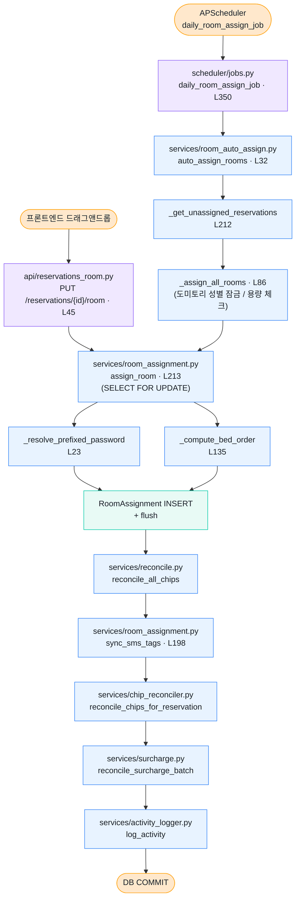

# 2. Room Assignment 파이프라인

객실 배정은 두 가지 진입점이 있습니다:

1. **수동 배정** — 프론트엔드에서 드래그앤드롭 → API 호출
2. **자동 배정** — APScheduler `daily_room_assign_job`이 미래 날짜 예약을 일괄 배정

두 경로 모두 최종적으로 `services/room_assignment.py`의 핵심 함수를 거치며, 배정 변경 시 `ReservationSmsAssignment` (SMS 태그)가 자동 동기화됩니다.

## Mermaid 흐름도

## 핵심 함수

### 수동 배정 경로

| 단계 | 함수 | 위치 |
|------|------|------|
| 라우터 | `assign_room` | `app/api/reservations_room.py:45` |
| 서비스 | `assign_room` | `app/services/room_assignment.py:213` |
| 비밀번호 | `_resolve_prefixed_password` | `app/services/room_assignment.py:23` |
| 침대 순서 | `_compute_bed_order` | `app/services/room_assignment.py:135` |
| Chip 정합성 | `reconcile_all_chips` | `app/services/reconcile.py` |
| SMS 태그 동기화 | `sync_sms_tags` | `app/services/room_assignment.py:198` |

### 자동 배정 경로

| 단계 | 함수 | 위치 |
|------|------|------|
| Cron 잡 | `daily_room_assign_job` | `app/scheduler/jobs.py:350` |
| 메인 루프 | `auto_assign_rooms` | `app/services/room_auto_assign.py:32` |
| 미배정 조회 | `_get_unassigned_reservations` | `app/services/room_auto_assign.py:212` |
| 일괄 배정 | `_assign_all_rooms` | `app/services/room_auto_assign.py:272` |

## 비고

- `SELECT FOR UPDATE`로 동시 배정 충돌을 막습니다 (`services/room_assignment.py:213`).
- 도미토리는 첫 배정 시점에 성별이 "잠겨" 다른 성별 예약이 들어올 수 없게 됩니다.
- 배정/해제 시 `ReservationSmsAssignment`가 자동으로 추가/제거되어, 객실 정보가 들어간 SMS 템플릿이 누락 없이 발송되도록 보장합니다.
