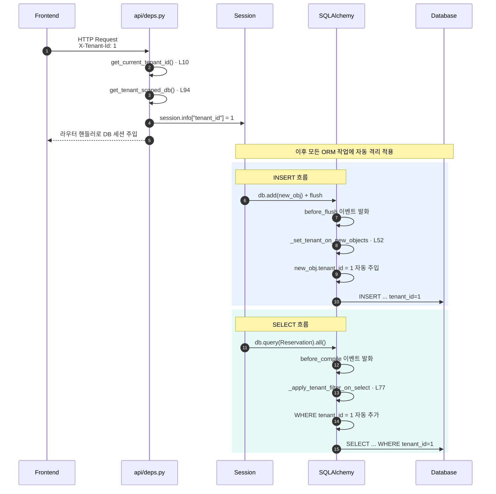

# 3. Multi-Tenant Filtering 파이프라인

테넌트 격리는 **SQLAlchemy 이벤트 훅 + 세션 정보(session.info)** 조합으로 구현되어 있습니다. 라우터에서 `tenant_id`를 명시하지 않아도 SELECT/INSERT 시 자동으로 필터링/주입됩니다.

## 시퀀스 다이어그램 — HTTP 요청 흐름



## 구성 요소 흐름도

```mermaid
flowchart LR
    subgraph Setup["요청 진입 시점"]
        Header["X-Tenant-Id<br/>HTTP 헤더"]:::trigger
        Deps["api/deps.py<br/>get_tenant_scoped_db · L94"]:::api
        SessFor["db/database.py<br/>session_for_tenant"]:::svc
        Info["session.info<br/>['tenant_id', 'bypass_tenant']"]:::db

        Header --> Deps --> SessFor --> Info
    end

    subgraph Events["SQLAlchemy 이벤트 훅<br/>db/tenant_context.py"]
        Resolve["_resolve_tenant_context · L22"]:::svc
        BeforeFlush["_set_tenant_on_new_objects · L52<br/>@event.listens_for(Session, 'before_flush')"]:::svc
        BeforeCompile["_apply_tenant_filter_on_select · L77<br/>@event.listens_for(Query, 'before_compile')"]:::svc

        Resolve -.-> BeforeFlush
        Resolve -.-> BeforeCompile
    end

    Info --> Resolve

    BeforeFlush --> InsertDB["INSERT<br/>tenant_id 자동 주입"]:::db
    BeforeCompile --> SelectDB["SELECT<br/>WHERE tenant_id=X 자동 추가"]:::db

    subgraph Bypass["격리 우회"]
        BypassCtx["bypass_tenant_filter()<br/>context manager"]:::override
        BypassUse["스케줄러 / 마이그레이션 /<br/>전역 작업"]:::override
        BypassCtx --> BypassUse
    end

    BypassUse -.->|session.info<br/>['bypass_tenant']=True| Info

    classDef trigger fill:#FFE8CC,stroke:#FF9F00,color:#191F28
    classDef api fill:#F0E8FF,stroke:#8B5CF6,color:#191F28
    classDef svc fill:#E8F3FF,stroke:#3182F6,color:#191F28
    classDef db fill:#E8FAF5,stroke:#00C9A7,color:#191F28
    classDef override fill:#FFE4E1,stroke:#F04452,color:#191F28
```

## 핵심 함수

| 역할 | 함수 | 위치 |
|------|------|------|
| 헤더 파싱 | `get_current_tenant_id` | `app/api/deps.py:10` |
| 세션 의존성 | `get_tenant_scoped_db` | `app/api/deps.py:94` |
| 세션 생성 | `session_for_tenant` | `app/db/database.py` |
| 컨텍스트 조회 | `_resolve_tenant_context` | `app/db/tenant_context.py:22` |
| INSERT 훅 | `_set_tenant_on_new_objects` | `app/db/tenant_context.py:52` (`before_flush`) |
| SELECT 훅 | `_apply_tenant_filter_on_select` | `app/db/tenant_context.py:77` (`before_compile`) |
| 모델 등록 | `register_tenant_model` | `app/db/tenant_context.py:70` |
| 격리 우회 | `bypass_tenant_filter` | `app/db/tenant_context.py` |

## 비고

- `TenantMixin`을 상속한 모델만 자동 필터링 대상 (`register_tenant_model` 데코레이터로 추적).
- `User`, `Tenant` 모델은 `TenantMixin`을 안 쓰므로 자동 필터링 제외 — 로그인 시 모든 테넌트 사용자를 조회할 수 있어야 하기 때문.
- `bypass_tenant_filter()`를 잘못 쓰면 데이터 누출 위험이 있으므로, 사용처는 스케줄러 잡과 마이그레이션 코드로 한정해야 합니다.
