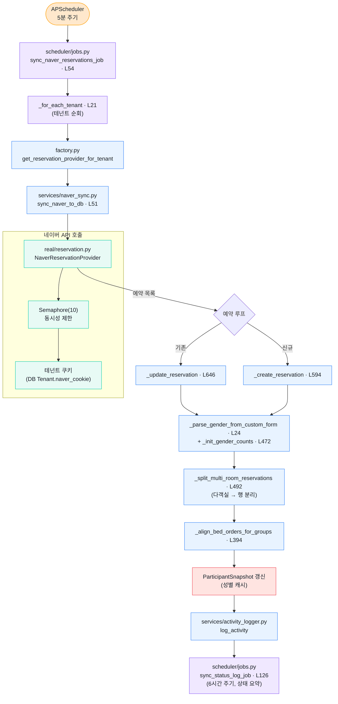

# 4. Naver Sync 파이프라인

5분마다 네이버 스마트플레이스 예약을 가져와 로컬 DB와 동기화합니다. 신규 예약은 INSERT, 변경된 예약은 UPDATE, 다인실/다객실 예약은 자동 분할합니다.

## Mermaid 흐름도

## 핵심 함수

| 단계 | 함수 | 위치 |
|------|------|------|
| Cron 잡 (5분) | `sync_naver_reservations_job` | `app/scheduler/jobs.py:54` |
| 테넌트 순회 | `_for_each_tenant` | `app/scheduler/jobs.py:21` |
| Unstable 동기화 | `sync_unstable_reservations_job` | `app/scheduler/jobs.py:283` |
| 메인 동기화 | `sync_naver_to_db` | `app/services/naver_sync.py:51` |
| 신규 생성 | `_create_reservation` | `app/services/naver_sync.py:594` |
| 기존 갱신 | `_update_reservation` | `app/services/naver_sync.py:646` |
| 성별 파싱 | `_parse_gender_from_custom_form` | `app/services/naver_sync.py:24` |
| 다객실 분할 | `_split_multi_room_reservations` | `app/services/naver_sync.py:492` |
| 침대 순서 정렬 | `_align_bed_orders_for_groups` | `app/services/naver_sync.py:394` |
| 상태 로그 (6시간) | `sync_status_log_job` | `app/scheduler/jobs.py:126` |

## 관련 잡

| 잡 | 주기 | 용도 |
|----|------|------|
| `sync_naver_reservations_job` | 5분 | 안정 동기화 (확정 예약) |
| `sync_unstable_reservations_job` | 별도 | 최근 변경 가능성 있는 예약 |
| `sync_status_log_job` | 6시간 (00,06,12,18) | 동기화 상태 요약 로그 |
| `detect_consecutive_stays_job` | — | 연박 자동 인식 |
| `reconcile_today_reservations_job` | — | 당일 예약 정합성 검증 |
| `refresh_snapshots_job` | — | `ParticipantSnapshot` 재계산 |

## 비고

- 쿠키 인증 — `Tenant.naver_cookie`에 저장된 쿠키로 네이버 비공개 API에 접근합니다. 만료 시 동기화가 통째로 실패하므로 갱신이 필요합니다.
- `Semaphore(10)` — 네이버 측 rate limit 대응. 너무 공격적으로 호출하면 IP 차단 가능.
- "다객실 예약" — 1개 예약이 2개 이상 객실을 점유하는 경우 `_split_multi_room_reservations`가 행을 분리하여 객실 배정 시스템과 호환되도록 변환합니다.
- 이 파이프라인은 **`bypass_tenant_filter()`를 쓰지 않습니다.** 테넌트별로 순회하면서 각자의 세션을 만들어 격리합니다.
