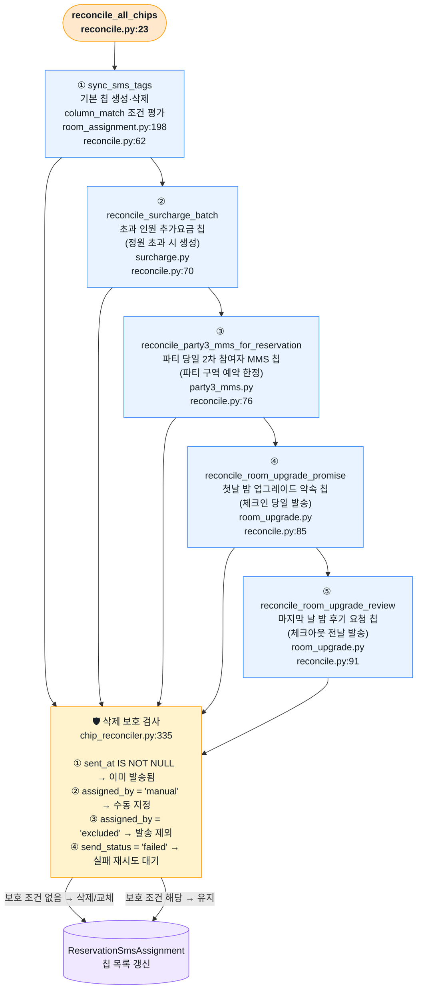
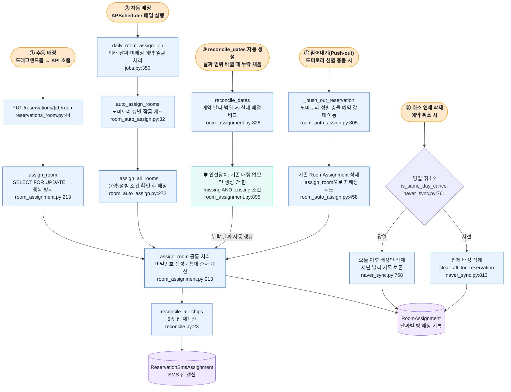
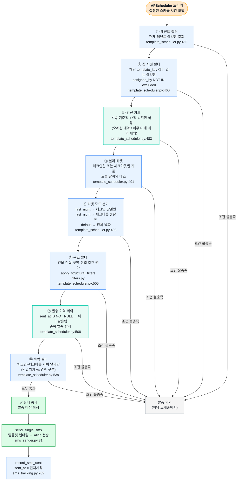

# 5. 예약 변경 전체 경로 — 입력 6개 → Reconcile → SMS 발송

> 🔴 버그·보호 없음 &nbsp;|&nbsp; ⚠️ 일부만 처리 &nbsp;|&nbsp; 🛡 보호 로직 있음 &nbsp;|&nbsp; ✅ 정상

---

## 전체 개요 다이어그램

---

## A. `reconcile_all_chips` 내부 — 5종 칩 상세

`reconcile_all_chips`(`reconcile.py:23`)는 5개 함수를 순서대로 호출합니다.  
각 칩은 이미 발송됐거나 수동으로 지정된 경우 **삭제 보호**를 받습니다.

### 칩 종류 요약

| # | 칩 키 예시 | 생성 조건 | 보호 조건 |
|---|-----------|----------|----------|
| ① | `column_match` 기반 | 예약이 템플릿 스케줄 조건 충족 | sent_at, manual, excluded, failed |
| ② | 추가요금 | 배정 인원 > 객실 정원 | 동일 |
| ③ | 파티3차MMS | 파티 구역 예약 + 당일 | 동일 |
| ④ | 업그레이드약속 | 첫날 밤 배정 완료 | 동일 |
| ⑤ | 업그레이드후기 | 마지막 밤 배정 완료 | 동일 |

---

## B. RoomAssignment 변경 경로 — 5가지 진입점

`RoomAssignment` 테이블(날짜별 방 배정 기록)은 다음 5가지 경로에서 생성·수정·삭제됩니다.

### RoomAssignment 변경 요약

| # | 경로 | 트리거 | 삭제 | 생성 |
|---|------|--------|------|------|
| ① | 수동 배정 | 직원 드래그앤드롭 | 이전 배정 교체 | ✅ |
| ② | 자동 배정 | APScheduler 매일 | — | ✅ (미배정만) |
| ③ | reconcile_dates | 날짜 범위 변경 후 | 범위 밖 삭제 | ✅ (기존 있을 때만) |
| ④ | 밀어내기 | 도미토리 성별 충돌 | 기존 배정 강제 삭제 | ✅ (재배정 시도) |
| ⑤ | 취소 연쇄 | 예약 취소 | 당일: 오늘 이후만 / 사전: 전체 | — |

---

## C. SMS 발송 필터 체인 — 8단계 상세

`_get_targets_standard`(`template_scheduler.py:419`)는 8개 필터를 순서대로 통과해야 SMS가 발송됩니다.  
하나라도 걸리면 그 예약은 해당 스케줄에서 제외됩니다.

### 8단계 필터 요약

| # | 필터 | 통과 조건 | 목적 |
|---|------|----------|------|
| ① | 테넌트 | 현재 테넌트 예약 | 멀티테넌트 격리 |
| ② | 칩 사전 | template_key 칩 보유 + 미제외 | 발송 대상 칩 존재 확인 |
| ③ | 안전 가드 | 기준일 ±7일 이내 | 과거/미래 오발송 방지 |
| ④ | 날짜 타겟 | 체크인 또는 체크아웃 = 오늘 | 발송 시점 맞추기 |
| ⑤ | 타겟 모드 | first/last_night 조건 일치 | 첫날·마지막날 분기 |
| ⑥ | 구조 필터 | 건물·구역·성별 설정 일치 | 템플릿 타겟 세분화 |
| ⑦ | 발송 이력 | sent_at IS NULL | 중복 발송 차단 |
| ⑧ | 숙박 필터 | 체크인 ≤ 기준일 < 체크아웃 | 재실 기간만 발송 |
