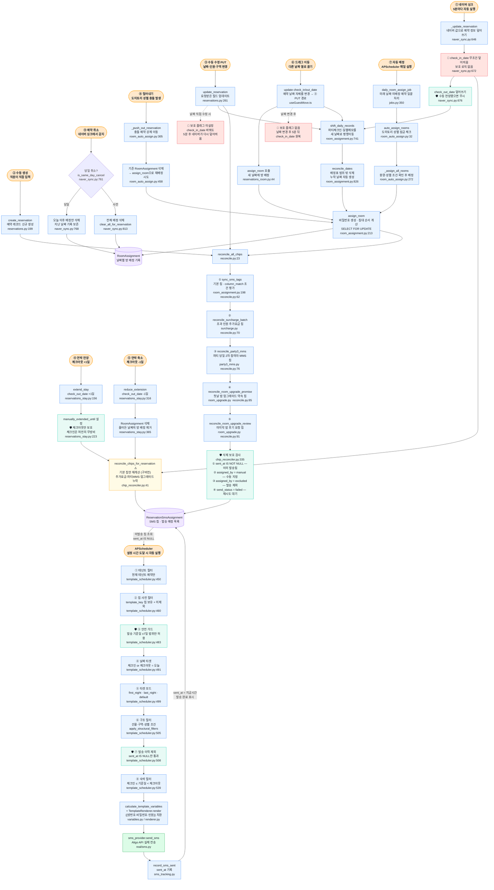

# 5. 예약 변경 전체 경로 — 입력 9개 → Reconcile → 5종 칩 → SMS 8단계 필터 → 발송

> 🔴 버그·보호 없음 &nbsp;|&nbsp; ⚠️ 일부만 처리 &nbsp;|&nbsp; 🛡 보호 로직 있음 &nbsp;|&nbsp; ✅ 정상

```mermaid
flowchart TB
    classDef entry  fill:#FFE8CC,stroke:#FF9F00,color:#191F28,font-weight:bold
    classDef ok     fill:#E8F3FF,stroke:#3182F6,color:#191F28
    classDef warn   fill:#FFFBE6,stroke:#FF9F00,color:#191F28
    classDef bug    fill:#FFE4E1,stroke:#F04452,color:#191F28
    classDef shield fill:#E8FAF5,stroke:#00C9A7,color:#191F28
    classDef db     fill:#F0E8FF,stroke:#8B5CF6,color:#191F28
    classDef sms    fill:#dcfce7,stroke:#16a34a,color:#191F28

    %% ════════════════════════════════════════
    %% 진입점 — 예약 변경 6개
    %% ════════════════════════════════════════
    N(["① 네이버 싱크\n5분마다 자동 실행"]):::entry
    C(["② 수동 생성\n직원이 직접 입력"]):::entry
    U(["③ 수동 수정 PUT\n날짜·인원·구역 변경"]):::entry
    E(["④ 연박 연장\n체크아웃 +1일"]):::entry
    R(["⑤ 연박 축소\n체크아웃 -1일"]):::entry
    D(["⑥ 드래그 이동\n다른 날짜 열로 끌기"]):::entry

    %% 진입점 — 객실 배정 변경 3개
    A_AUTO(["⑦ 자동 배정\nAPScheduler 매일 실행"]):::entry
    PO_IN(["⑧ 밀어내기\n도미토리 성별 충돌 발생"]):::entry
    CC_IN(["⑨ 예약 취소\n네이버 싱크에서 감지"]):::entry

    %% ════════════════════════════════════════
    %% ① 네이버 싱크 처리
    %% ════════════════════════════════════════
    n1["_update_reservation\n네이버 값으로 예약 정보 덮어쓰기\nnaver_sync.py:646"]:::ok
    n2["🔴 check_in_date 무조건 덮어씌움\n보호 로직 없음\nnaver_sync.py:672"]:::bug
    n3["check_out_date 덮어쓰기\n🛡 수동 연장됐으면 무시\nnaver_sync.py:676"]:::shield

    %% ② 수동 생성
    c1["create_reservation\n예약 레코드 신규 생성\nreservations.py:199"]:::ok

    %% ③ 수동 수정
    u1["update_reservation\n요청받은 필드 업데이트\nreservations.py:261"]:::ok
    u2["🔴 보호 플래그 미설정\ncheck_in_date 바꿔도\n5분 후 네이버가 다시 덮어씌움"]:::bug

    %% ④ 연박 연장
    e1["extend_stay\ncheck_out_date +1일\nreservations_stay.py:156"]:::ok
    e2["manually_extended_until 설정\n🛡 체크아웃만 보호\n체크인은 여전히 무방비\nreservations_stay.py:223"]:::shield

    %% ⑤ 연박 축소
    r1["reduce_extension\ncheck_out_date -1일\nreservations_stay.py:316"]:::ok
    r2["RoomAssignment 삭제\n줄어든 날짜의 방 배정 제거\nreservations_stay.py:365"]:::ok

    %% ⑥ 드래그 이동
    d1["update check_in/out_date\n예약 날짜 자체를 변경 → ③ PUT 경로\nuseGuestMove.ts"]:::ok
    d2["assign_room 호출\n새 날짜에 방 배정\nreservations_room.py:44"]:::ok
    d3["🔴 보호 플래그 없음\n날짜 변경 후 5분 뒤 check_in_date 원복"]:::bug

    %% ⑦ 자동 배정
    a1["daily_room_assign_job\n미래 날짜 미배정 예약 일괄 처리\njobs.py:350"]:::ok
    a2["auto_assign_rooms\n도미토리 성별 잠금 체크\nroom_auto_assign.py:32"]:::ok
    a3["_assign_all_rooms\n용량·성별 조건 확인 후 배정\nroom_auto_assign.py:272"]:::ok

    %% ⑧ 밀어내기
    po1["_push_out_reservation\n충돌 예약 강제 이동\nroom_auto_assign.py:305"]:::ok
    po2["기존 RoomAssignment 삭제\n→ assign_room으로 재배정 시도\nroom_auto_assign.py:458"]:::ok

    %% ⑨ 예약 취소 연쇄
    cc_chk{"당일 취소?\nis_same_day_cancel\nnaver_sync.py:761"}
    cc1["오늘 이후 배정만 삭제\n지난 날짜 기록 보존\nnaver_sync.py:768"]:::ok
    cc2["전체 배정 삭제\nclear_all_for_reservation\nnaver_sync.py:813"]:::ok

    %% ════════════════════════════════════════
    %% 공유 Reconcile 함수
    %% ════════════════════════════════════════
    SHIFT["shift_daily_records\n파티체크인·일별메모를\n새 날짜로 평행이동\nroom_assignment.py:741"]:::ok

    RDATES["reconcile_dates\n배정표 범위 밖 삭제\n누락 날짜 자동 생성\nroom_assignment.py:826"]:::ok

    CORE["assign_room\n비밀번호 생성 · 침대 순서 계산\nSELECT FOR UPDATE\nroom_assignment.py:213"]:::ok

    RBASIC["reconcile_chips_for_reservation  ⚠️\n기본 칩만 재계산 (구버전)\n추가요금·파티MMS·업그레이드 누락\nchip_reconciler.py:41"]:::warn

    %% ════════════════════════════════════════
    %% A. reconcile_all_chips → 5종 칩 순차 실행
    %% ════════════════════════════════════════
    RALL["reconcile_all_chips\nreconcile.py:23"]:::ok

    chip1["① sync_sms_tags\n기본 칩 · column_match 조건 평가\nroom_assignment.py:198  reconcile.py:62"]:::ok
    chip2["② reconcile_surcharge_batch\n초과 인원 추가요금 칩\nsurcharge.py  reconcile.py:70"]:::ok
    chip3["③ reconcile_party3_mms\n파티 당일 2차 참여자 MMS 칩\nparty3_mms.py  reconcile.py:76"]:::ok
    chip4["④ reconcile_room_upgrade_promise\n첫날 밤 업그레이드 약속 칩\nroom_upgrade.py  reconcile.py:85"]:::ok
    chip5["⑤ reconcile_room_upgrade_review\n마지막 밤 후기 요청 칩\nroom_upgrade.py  reconcile.py:91"]:::ok

    GUARD["🛡 삭제 보호 검사\nchip_reconciler.py:335\n① sent_at IS NOT NULL — 이미 발송됨\n② assigned_by = manual — 수동 지정\n③ assigned_by = excluded — 발송 제외\n④ send_status = failed — 재시도 대기"]:::shield

    %% ════════════════════════════════════════
    %% DB
    %% ════════════════════════════════════════
    DB_ROOM[("RoomAssignment\n날짜별 방 배정 기록")]:::db
    DB_CHIP[("ReservationSmsAssignment\nSMS 칩 · 발송 예정 목록")]:::db

    %% ════════════════════════════════════════
    %% C. SMS 발송 — 8단계 필터 체인
    %% ════════════════════════════════════════
    SCHED(["APScheduler\n설정 시간 도달 시 자동 실행"]):::entry

    f1["① 테넌트 필터\n현재 테넌트 예약만\ntemplate_scheduler.py:450"]:::ok
    f2["② 칩 사전 필터\ntemplate_key 칩 보유 + 미제외\ntemplate_scheduler.py:460"]:::ok
    f3["🛡 ③ 안전 가드\n발송 기준일 ±7일 범위만 허용\ntemplate_scheduler.py:483"]:::shield
    f4["④ 날짜 타겟\n체크인 or 체크아웃 = 오늘\ntemplate_scheduler.py:491"]:::ok
    f5["⑤ 타겟 모드\nfirst_night · last_night · default\ntemplate_scheduler.py:499"]:::ok
    f6["⑥ 구조 필터\n건물·구역·성별 조건\napply_structural_filters\ntemplate_scheduler.py:505"]:::ok
    f7["🛡 ⑦ 발송 이력 제외\nsent_at IS NULL만 통과\ntemplate_scheduler.py:508"]:::shield
    f8["⑧ 숙박 필터\n체크인 ≤ 기준일 < 체크아웃\ntemplate_scheduler.py:539"]:::ok

    RENDER["calculate_template_variables\n+ TemplateRenderer.render\n{{방번호·비밀번호·인원}} 치환\nvariables.py / renderer.py"]:::ok
    SEND["sms_provider.send_sms\nAligo API 실제 전송\nreal/sms.py"]:::sms
    TRACK["record_sms_sent\nsent_at 기록\nsms_tracking.py"]:::ok

    %% ════════════════════════════════════════
    %% 연결 — 예약 변경 6개 경로
    %% ════════════════════════════════════════
    N --> n1 --> n2 --> n3
    C --> c1
    U --> u1
    u1 -. "날짜 직접 수정 시" .-> u2
    E --> e1 --> e2
    R --> r1 --> r2
    D --> d1 --> d2
    d1 -. "날짜 변경 후" .-> d3

    %% 연결 — 객실 배정 변경 3개 경로
    A_AUTO --> a1 --> a2 --> a3 --> CORE
    PO_IN  --> po1 --> po2 --> CORE
    CC_IN  --> cc_chk
    cc_chk -->|"당일"| cc1
    cc_chk -->|"사전"| cc2
    cc1 & cc2 --> DB_ROOM

    %% → shift_daily_records (날짜 변경 경로들)
    n3 --> SHIFT
    u1 --> SHIFT
    d1 --> SHIFT
    SHIFT --> RDATES

    %% → assign_room 공통 처리
    d2     --> CORE
    RDATES --> CORE
    CORE   --> DB_ROOM
    CORE   --> RALL

    %% → reconcile_all_chips (완전한 재계산 경로)
    c1 --> RALL
    u1 --> RALL

    %% reconcile_all_chips → 5종 칩 순차 실행
    RALL  --> chip1 --> chip2 --> chip3 --> chip4 --> chip5 --> GUARD
    GUARD --> DB_CHIP

    %% → reconcile_chips_for_reservation (구버전, 일부 경로)
    n2 --> RBASIC
    e2 --> RBASIC
    r2 --> RBASIC
    RBASIC --> DB_CHIP

    %% SMS 발송 파이프라인 — 8단계 필터
    DB_CHIP -->|"미발송 칩 조회\nsent_at IS NULL"| SCHED
    SCHED --> f1 --> f2 --> f3 --> f4 --> f5 --> f6 --> f7 --> f8 --> RENDER
    RENDER --> SEND --> TRACK
    TRACK  -->|"sent_at = 지금시간\n발송 완료 표시"| DB_CHIP
```
