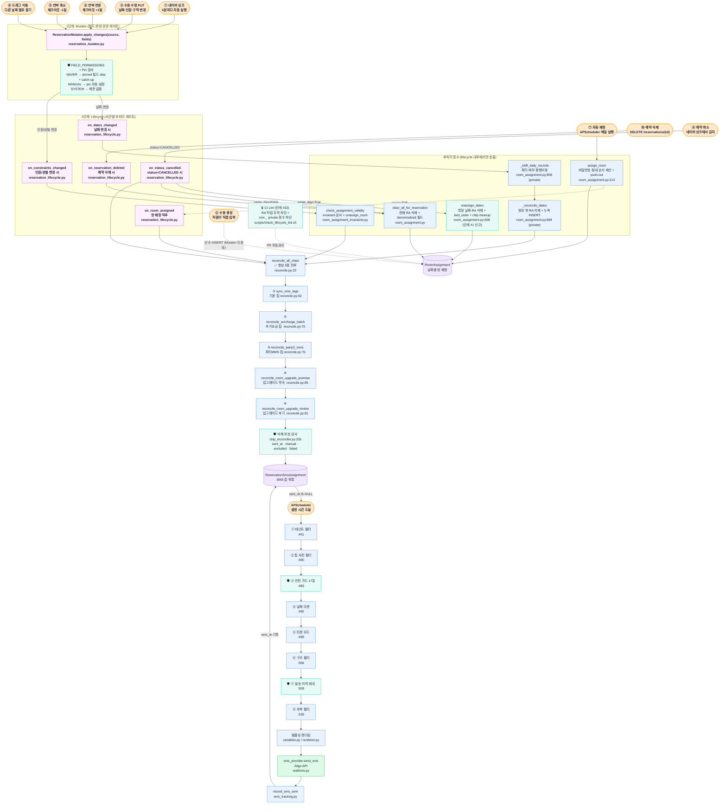

# 5. 예약 변경 전체 경로 — Mutator + Lifecycle 두 단계 게이트웨이

> 🔴 버그·보호 없음 &nbsp;|&nbsp; ⚠️ 일부만 처리 &nbsp;|&nbsp; 🛡 보호 로직 있음 &nbsp;|&nbsp; ✅ 정상

## 구조 요약

| 영역 | 현재 구조 |
|------|----------|
| **네이버 덮어쓰기 보호** | Mutator pin (`check_in_pinned`, `check_out_pinned`) |
| **후처리 일관성** | Lifecycle 5장 매뉴얼 (`on_dates_changed` / `on_constraints_changed` / `on_status_cancelled` / `on_room_assigned` / `on_reservation_deleted`) |
| **보호 방식** | `check_in/out_pinned` (동기화 보호) + `manually_extended_until` (UI "수동 연박" 표시) — 책임 분리 |
| **칩 재계산** | `reconcile_all_chips` 5종 단일 진입점 |
| **RA 직접 조작** | 0건 — `unassign_dates` 단일 헬퍼로 통합 |
| **`_shift_daily_records` / `_reconcile_dates`** | private (`_` prefix) + lifecycle 내부 호출만 |
| **회귀 차단** | `scripts/check_lifecycle_lint.sh` (RA 직접 조작 + non-_ 호출 차단) |
| **신규 caller 추가 시** | 사건 종류만 결정 → Lifecycle 매뉴얼이 처리 + lint 가 우회 차단 |
| **새 경로 추가 시** | Mutator 1곳만 수정 |
