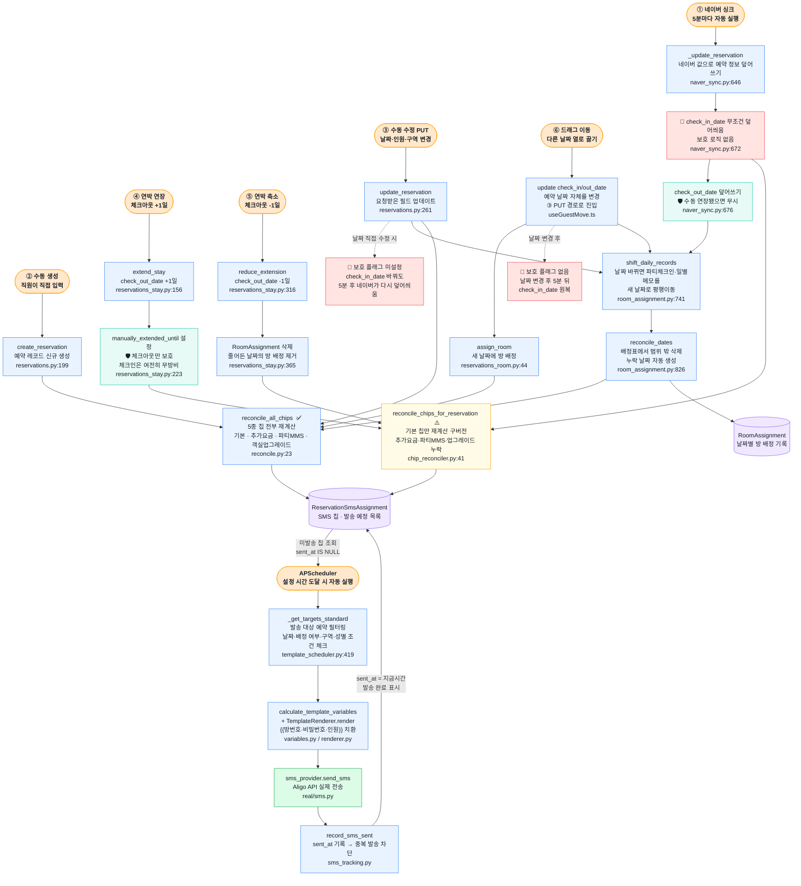

# 5. 예약 변경 전체 경로 — 입력 6개 → Reconcile → SMS 발송

> 🔴 버그·보호 없음 &nbsp;|&nbsp; ⚠️ 일부만 처리 &nbsp;|&nbsp; 🛡 보호 로직 있음 &nbsp;|&nbsp; ✅ 정상

```mermaid
flowchart TB
    classDef entry  fill:#FFE8CC,stroke:#FF9F00,color:#191F28,font-weight:bold
    classDef ok     fill:#E8F3FF,stroke:#3182F6,color:#191F28
    classDef warn   fill:#FFFBE6,stroke:#FF9F00,color:#191F28
    classDef bug    fill:#FFE4E1,stroke:#F04452,color:#191F28
    classDef shield fill:#E8FAF5,stroke:#00C9A7,color:#191F28
    classDef db     fill:#F0E8FF,stroke:#8B5CF6,color:#191F28
    classDef sms    fill:#dcfce7,stroke:#16a34a,color:#191F28

    %% ════════════════════════════════════════
    %% 입력 6개 경로
    %% ════════════════════════════════════════

    N(["① 네이버 싱크\n5분마다 자동 실행"]):::entry
    C(["② 수동 생성\n직원이 직접 입력"]):::entry
    U(["③ 수동 수정 PUT\n날짜·인원·구역 변경"]):::entry
    E(["④ 연박 연장\n체크아웃 +1일"]):::entry
    R(["⑤ 연박 축소\n체크아웃 -1일"]):::entry
    D(["⑥ 드래그 이동\n다른 날짜 열로 끌기"]):::entry

    %% ── ① 네이버 싱크 경로 ──────────────────
    n1["_update_reservation\n네이버 값으로 예약 정보 덮어쓰기\nnaver_sync.py:646"]:::ok
    n2["🔴 check_in_date 무조건 덮어씌움\n보호 로직 없음\nnaver_sync.py:672"]:::bug
    n3["check_out_date 덮어쓰기\n🛡 수동 연장됐으면 무시\nnaver_sync.py:676"]:::shield

    %% ── ② 수동 생성 경로 ───────────────────
    c1["create_reservation\n예약 레코드 신규 생성\nreservations.py:199"]:::ok

    %% ── ③ 수동 수정 경로 ───────────────────
    u1["update_reservation\n요청받은 필드 업데이트\nreservations.py:261"]:::ok
    u2["🔴 보호 플래그 미설정\ncheck_in_date 바꿔도\n5분 후 네이버가 다시 덮어씌움"]:::bug

    %% ── ④ 연박 연장 경로 ───────────────────
    e1["extend_stay\ncheck_out_date +1일\nreservations_stay.py:156"]:::ok
    e2["manually_extended_until 설정\n🛡 체크아웃만 보호\n체크인은 여전히 무방비\nreservations_stay.py:223"]:::shield

    %% ── ⑤ 연박 축소 경로 ───────────────────
    r1["reduce_extension\ncheck_out_date -1일\nreservations_stay.py:316"]:::ok
    r2["RoomAssignment 삭제\n줄어든 날짜의 방 배정 제거\nreservations_stay.py:365"]:::ok

    %% ── ⑥ 드래그 이동 경로 ─────────────────
    d1["update check_in/out_date\n예약 날짜 자체를 변경\n③ PUT 경로로 진입\nuseGuestMove.ts"]:::ok
    d2["assign_room\n새 날짜에 방 배정\nreservations_room.py:44"]:::ok
    d3["🔴 보호 플래그 없음\n날짜 변경 후 5분 뒤\ncheck_in_date 원복"]:::bug

    %% ════════════════════════════════════════
    %% 공유 Reconcile 함수들
    %% ════════════════════════════════════════

    SHIFT["shift_daily_records\n날짜 바뀌면 파티체크인·일별메모를\n새 날짜로 평행이동\nroom_assignment.py:741"]:::ok

    RDATES["reconcile_dates\n배정표에서 범위 밖 삭제\n누락 날짜 자동 생성\nroom_assignment.py:826"]:::ok

    RALL["reconcile_all_chips  ✅\n5종 칩 전부 재계산\n기본 · 추가요금 · 파티MMS · 객실업그레이드\nreconcile.py:23"]:::ok

    RBASIC["reconcile_chips_for_reservation  ⚠️\n기본 칩만 재계산 구버전\n추가요금·파티MMS·업그레이드 누락\nchip_reconciler.py:41"]:::warn

    %% ════════════════════════════════════════
    %% DB
    %% ════════════════════════════════════════

    DB_ROOM[("RoomAssignment\n날짜별 방 배정 기록")]:::db
    DB_CHIP[("ReservationSmsAssignment\nSMS 칩 · 발송 예정 목록")]:::db

    %% ════════════════════════════════════════
    %% SMS 발송 파이프라인
    %% ════════════════════════════════════════

    SCHED(["APScheduler\n설정 시간 도달 시 자동 실행"]):::entry

    FILTER["_get_targets_standard\n발송 대상 예약 필터링\n날짜·배정 여부·구역·성별 조건 체크\ntemplate_scheduler.py:419"]:::ok

    RENDER["calculate_template_variables\n+ TemplateRenderer.render\n{{방번호·비밀번호·인원}} 치환\nvariables.py / renderer.py"]:::ok

    SEND["sms_provider.send_sms\nAligo API 실제 전송\nreal/sms.py"]:::sms

    TRACK["record_sms_sent\nsent_at 기록 → 중복 발송 차단\nsms_tracking.py"]:::ok

    %% ════════════════════════════════════════
    %% 연결
    %% ════════════════════════════════════════

    %% ① 네이버 싱크
    N --> n1 --> n2 --> n3

    %% ② 수동 생성
    C --> c1

    %% ③ 수동 수정
    U --> u1
    u1 -. "날짜 직접 수정 시" .-> u2

    %% ④ 연박 연장
    E --> e1 --> e2

    %% ⑤ 연박 축소
    R --> r1 --> r2

    %% ⑥ 드래그
    D --> d1 --> d2
    d1 -. "날짜 변경 후" .-> d3

    %% → shift_daily_records (날짜 변경 발생한 경로들)
    n3  --> SHIFT
    u1  --> SHIFT
    d1  --> SHIFT
    SHIFT --> RDATES

    %% → reconcile_all_chips (완전한 재계산 경로들)
    c1     --> RALL
    u1     --> RALL
    d2     --> RALL
    RDATES --> RALL

    %% → reconcile_chips_for_reservation (구버전, 일부 경로들)
    n2 --> RBASIC
    e2 --> RBASIC
    r2 --> RBASIC

    %% → DB
    RDATES --> DB_ROOM
    RALL   --> DB_CHIP
    RBASIC --> DB_CHIP

    %% SMS 파이프라인
    DB_CHIP -->|"미발송 칩 조회\nsent_at IS NULL"| SCHED
    SCHED   --> FILTER --> RENDER --> SEND --> TRACK
    TRACK   -->|"sent_at = 지금시간\n발송 완료 표시"| DB_CHIP
```
