# 5. 예약 변경 전체 경로 — 현재 구조 vs ReservationMutator 적용 후

> 🔴 버그·보호 없음 &nbsp;|&nbsp; ⚠️ 일부만 처리 &nbsp;|&nbsp; 🛡 보호 로직 있음 &nbsp;|&nbsp; ✅ 정상

```mermaid
flowchart LR
    classDef entry  fill:#FFE8CC,stroke:#FF9F00,color:#191F28,font-weight:bold
    classDef ok     fill:#E8F3FF,stroke:#3182F6,color:#191F28
    classDef warn   fill:#FFFBE6,stroke:#FF9F00,color:#191F28
    classDef bug    fill:#FFE4E1,stroke:#F04452,color:#191F28
    classDef shield fill:#E8FAF5,stroke:#00C9A7,color:#191F28
    classDef db     fill:#F0E8FF,stroke:#8B5CF6,color:#191F28
    classDef sms    fill:#dcfce7,stroke:#16a34a,color:#191F28
    classDef gate   fill:#FFF0FF,stroke:#9B59B6,color:#191F28,font-weight:bold

    %% ════════════════════════════════════════════════════════
    %% 왼쪽: 현재 구조
    %% ════════════════════════════════════════════════════════
    subgraph BEFORE["❌  현재 구조 — 경로별 개별 조립, 버그 3개"]
        direction TB

        N(["① 네이버 싱크\n5분마다 자동 실행"]):::entry
        C(["② 수동 생성\n직원이 직접 입력"]):::entry
        U(["③ 수동 수정 PUT\n날짜·인원·구역 변경"]):::entry
        E(["④ 연박 연장\n체크아웃 +1일"]):::entry
        R(["⑤ 연박 축소\n체크아웃 -1일"]):::entry
        D(["⑥ 드래그 이동\n다른 날짜 열로 끌기"]):::entry
        A_AUTO(["⑦ 자동 배정\nAPScheduler 매일 실행"]):::entry
        PO_IN(["⑧ 밀어내기\n도미토리 성별 충돌"]):::entry
        CC_IN(["⑨ 예약 취소\n네이버 싱크에서 감지"]):::entry

        n1["_update_reservation\n네이버 값 덮어쓰기\nnaver_sync.py:646"]:::ok
        n2["🔴 check_in_date 무조건 덮어씌움\n보호 로직 없음\nnaver_sync.py:672"]:::bug
        n3["check_out_date 덮어쓰기\n🛡 수동 연장됐으면 무시\nnaver_sync.py:676"]:::shield
        c1["create_reservation\n예약 레코드 신규 생성\nreservations.py:199"]:::ok
        u1["update_reservation\n요청받은 필드 업데이트\nreservations.py:261"]:::ok
        u2["🔴 보호 플래그 미설정\n5분 후 check_in_date 원복"]:::bug
        e1["extend_stay\ncheck_out_date +1일\nreservations_stay.py:156"]:::ok
        e2["manually_extended_until 설정\n🛡 체크아웃만 보호\nreservations_stay.py:223"]:::shield
        r1["reduce_extension\ncheck_out_date -1일\nreservations_stay.py:316"]:::ok
        r2["RoomAssignment 삭제\nreservations_stay.py:365"]:::ok
        d1["update check_in/out_date\n날짜 변경 → ③ PUT 경로\nuseGuestMove.ts"]:::ok
        d2["assign_room 호출\n새 날짜 방 배정\nreservations_room.py:44"]:::ok
        d3["🔴 보호 플래그 없음\n5분 뒤 check_in_date 원복"]:::bug
        a1["daily_room_assign_job\njobs.py:350"]:::ok
        a2["auto_assign_rooms\nroom_auto_assign.py:32"]:::ok
        a3["_assign_all_rooms\nroom_auto_assign.py:272"]:::ok
        po1["_push_out_reservation\nroom_auto_assign.py:305"]:::ok
        po2["기존 배정 삭제 → 재배정\nroom_auto_assign.py:458"]:::ok
        cc_chk{"당일 취소?\nnaver_sync.py:761"}
        cc1["오늘 이후 배정만 삭제\nnaver_sync.py:768"]:::ok
        cc2["전체 배정 삭제\nnaver_sync.py:813"]:::ok

        SHIFT["shift_daily_records\n날짜 변경 시 파티·메모 평행이동\nroom_assignment.py:741"]:::ok
        RDATES["reconcile_dates\n범위 밖 삭제 · 누락 날짜 생성\nroom_assignment.py:826"]:::ok
        CORE["assign_room\n비밀번호·침대 순서 계산\nroom_assignment.py:213"]:::ok
        RBASIC["reconcile_chips_for_reservation  ⚠️\n기본 칩만 재계산 (구버전)\n추가요금·파티MMS·업그레이드 누락\nchip_reconciler.py:41"]:::warn
        RALL["reconcile_all_chips\nreconcile.py:23"]:::ok
        chip1["① sync_sms_tags\n기본 칩  reconcile.py:62"]:::ok
        chip2["② reconcile_surcharge_batch\n추가요금 칩  reconcile.py:70"]:::ok
        chip3["③ reconcile_party3_mms\n파티MMS 칩  reconcile.py:76"]:::ok
        chip4["④ reconcile_room_upgrade_promise\n업그레이드 약속  reconcile.py:85"]:::ok
        chip5["⑤ reconcile_room_upgrade_review\n업그레이드 후기  reconcile.py:91"]:::ok
        GUARD["🛡 삭제 보호 검사\nchip_reconciler.py:335\nsent_at · manual · excluded · failed"]:::shield
        DB_ROOM[("RoomAssignment\n날짜별 방 배정")]:::db
        DB_CHIP[("ReservationSmsAssignment\nSMS 칩 목록")]:::db

        SCHED(["APScheduler\n설정 시간 도달"]):::entry
        f1["① 테넌트 필터\n:450"]:::ok
        f2["② 칩 사전 필터\n:460"]:::ok
        f3["🛡 ③ 안전 가드 ±7일\n:483"]:::shield
        f4["④ 날짜 타겟\n:491"]:::ok
        f5["⑤ 타겟 모드\n:499"]:::ok
        f6["⑥ 구조 필터\n:505"]:::ok
        f7["🛡 ⑦ 발송 이력 제외\n:508"]:::shield
        f8["⑧ 숙박 필터\n:539"]:::ok
        RENDER["템플릿 렌더링\nvariables.py / renderer.py"]:::ok
        SEND["sms_provider.send_sms\nAligo API\nreal/sms.py"]:::sms
        TRACK["record_sms_sent\nsms_tracking.py"]:::ok

        N --> n1 --> n2 --> n3
        C --> c1
        U --> u1
        u1 -. "날짜 수정 시" .-> u2
        E --> e1 --> e2
        R --> r1 --> r2
        D --> d1 --> d2
        d1 -. "날짜 변경 후" .-> d3
        A_AUTO --> a1 --> a2 --> a3 --> CORE
        PO_IN  --> po1 --> po2 --> CORE
        CC_IN  --> cc_chk
        cc_chk -->|"당일"| cc1
        cc_chk -->|"사전"| cc2
        cc1 & cc2 --> DB_ROOM
        n3 --> SHIFT
        u1 --> SHIFT
        d1 --> SHIFT
        SHIFT --> RDATES
        d2     --> CORE
        RDATES --> CORE
        CORE --> DB_ROOM
        CORE --> RALL
        c1 --> RALL
        u1 --> RALL
        n2 --> RBASIC
        e2 --> RBASIC
        r2 --> RBASIC
        RBASIC --> DB_CHIP
        RALL --> chip1 --> chip2 --> chip3 --> chip4 --> chip5 --> GUARD --> DB_CHIP
        DB_CHIP -->|"sent_at IS NULL"| SCHED
        SCHED --> f1 --> f2 --> f3 --> f4 --> f5 --> f6 --> f7 --> f8 --> RENDER --> SEND --> TRACK
        TRACK -->|"sent_at 기록"| DB_CHIP
    end

    %% ════════════════════════════════════════════════════════
    %% 오른쪽: ReservationMutator 적용 후
    %% ════════════════════════════════════════════════════════
    subgraph AFTER["✅  Mutator + Lifecycle 적용 후 — 두 단계 단일 게이트웨이"]
        direction TB

        m_N(["① 네이버 싱크\n5분마다 자동 실행"]):::entry
        m_C(["② 수동 생성\n직원이 직접 입력"]):::entry
        m_U(["③ 수동 수정 PUT\n날짜·인원·구역 변경"]):::entry
        m_E(["④ 연박 연장\n체크아웃 +1일"]):::entry
        m_R(["⑤ 연박 축소\n체크아웃 -1일"]):::entry
        m_D(["⑥ 드래그 이동\n다른 날짜 열로 끌기"]):::entry
        m_A_AUTO(["⑦ 자동 배정\nAPScheduler 매일 실행"]):::entry
        m_DEL(["⑩ 예약 삭제\nDELETE /reservations/{id}"]):::entry
        m_CC_IN(["⑨ 예약 취소\n네이버 싱크에서 감지"]):::entry

        %% ── 1단계: Mutator (필드 변경 권한) ──
        subgraph GATE1["1단계: Mutator (필드 변경 권한 게이트)"]
            m_MUTATOR["ReservationMutator.apply_changes(source, fields)\nreservation_mutator.py"]:::gate
            m_PERM["🛡 FIELD_PERMISSIONS + Pin 검사\nNAVER → pinned 필드 skip + catch-up\nMANUAL → pin 자동 설정\nSYSTEM → 제한 없음"]:::shield
            m_MUTATOR --> m_PERM
        end

        %% ── 2단계: Lifecycle (사건별 후처리 매뉴얼 5장) ──
        subgraph GATE2["2단계: Lifecycle (사건별 후처리 게이트)"]
            m_LC_DATES["on_dates_changed\n날짜 변경 시\nreservation_lifecycle.py"]:::gate
            m_LC_CONST["on_constraints_changed\n인원/성별 변경 시\nreservation_lifecycle.py"]:::gate
            m_LC_CANCEL["on_status_cancelled\nstatus=CANCELLED 시\nreservation_lifecycle.py"]:::gate
            m_LC_ROOM["on_room_assigned\n방 배정 직후\nreservation_lifecycle.py"]:::gate
            m_LC_DEL["on_reservation_deleted\n예약 삭제 시\nreservation_lifecycle.py"]:::gate
        end

        %% ── 후처리 함수 (lifecycle 이 내부 호출, private 화됨) ──
        subgraph PROC["후처리 함수 (lifecycle 내부에서만 호출)"]
            m_SHIFT["_shift_daily_records\n파티·메모 평행이동\nroom_assignment.py:809 (private)"]:::ok
            m_RDATES["_reconcile_dates\n범위 밖 RA 삭제 + 누락 INSERT\nroom_assignment.py:894 (private)"]:::ok
            m_INVCHK["check_assignment_validity\ninvariant 검사 + unassign_room\nroom_assignment_invariants.py"]:::ok
            m_UNASSIGN_DATES["unassign_dates\n특정 날짜 RA 삭제 + bed_order + chip cleanup\nroom_assignment.py:668 (단계 #1 신규)"]:::shield
            m_CLEAR_ALL["clear_all_for_reservation\n전체 RA 삭제 + denormalized 필드\nroom_assignment.py"]:::ok
            m_CORE["assign_room\n비밀번호·침대 순서 계산 + push-out\nroom_assignment.py:213"]:::ok
        end

        m_RALL["reconcile_all_chips\n✅ 항상 5종 전부\nreconcile.py:23"]:::ok
        m_chip1["① sync_sms_tags\n기본 칩  reconcile.py:62"]:::ok
        m_chip2["② reconcile_surcharge_batch\n추가요금 칩  reconcile.py:70"]:::ok
        m_chip3["③ reconcile_party3_mms\n파티MMS 칩  reconcile.py:76"]:::ok
        m_chip4["④ reconcile_room_upgrade_promise\n업그레이드 약속  reconcile.py:85"]:::ok
        m_chip5["⑤ reconcile_room_upgrade_review\n업그레이드 후기  reconcile.py:91"]:::ok
        m_GUARD["🛡 삭제 보호 검사\nchip_reconciler.py:335\nsent_at · manual · excluded · failed"]:::shield
        m_DB_ROOM[("RoomAssignment\n날짜별 방 배정")]:::db
        m_DB_CHIP[("ReservationSmsAssignment\nSMS 칩 목록")]:::db

        m_LINT["🔒 CI Lint (단계 #22)\nRA 직접 조작 차단 +\nnon-_ private 함수 차단\nscripts/check_lifecycle_lint.sh"]:::shield

        m_SCHED(["APScheduler\n설정 시간 도달"]):::entry
        m_f1["① 테넌트 필터\n:451"]:::ok
        m_f2["② 칩 사전 필터\n:460"]:::ok
        m_f3["🛡 ③ 안전 가드 ±7일\n:483"]:::shield
        m_f4["④ 날짜 타겟\n:492"]:::ok
        m_f5["⑤ 타겟 모드\n:499"]:::ok
        m_f6["⑥ 구조 필터\n:506"]:::ok
        m_f7["🛡 ⑦ 발송 이력 제외\n:509"]:::shield
        m_f8["⑧ 숙박 필터\n:539"]:::ok
        m_RENDER["템플릿 렌더링\nvariables.py / renderer.py"]:::ok
        m_SEND["sms_provider.send_sms\nAligo API\nreal/sms.py"]:::sms
        m_TRACK["record_sms_sent\nsms_tracking.py"]:::ok

        %% 진입점 → Mutator (필드 변경)
        m_N & m_U & m_E & m_R & m_D --> m_MUTATOR
        m_C -.->|"신규 INSERT (Mutator 미경유)"| m_DB_ROOM

        %% Mutator 통과 후 → Lifecycle 분기
        m_PERM -->|"날짜 변경"| m_LC_DATES
        m_PERM -->|"인원/성별 변경"| m_LC_CONST
        m_CC_IN -->|"status=CANCELLED"| m_LC_CANCEL
        m_A_AUTO --> m_CORE
        m_CORE -.->|"assign 직후"| m_LC_ROOM
        m_DEL --> m_LC_DEL

        %% Lifecycle → 내부 후처리 호출
        m_LC_DATES --> m_SHIFT
        m_SHIFT --> m_RDATES
        m_RDATES --> m_RALL
        m_LC_CONST --> m_INVCHK
        m_INVCHK --> m_RALL
        m_LC_CANCEL -->|"same_day=True"| m_UNASSIGN_DATES
        m_LC_CANCEL -->|"same_day=False"| m_CLEAR_ALL
        m_LC_CANCEL --> m_RALL
        m_LC_ROOM --> m_RALL
        m_LC_DEL --> m_CLEAR_ALL

        %% 후처리 함수 → DB
        m_UNASSIGN_DATES --> m_DB_ROOM
        m_CLEAR_ALL --> m_DB_ROOM
        m_CORE --> m_DB_ROOM

        %% 칩 재계산 → SmsAssignment DB
        m_RALL --> m_chip1 --> m_chip2 --> m_chip3 --> m_chip4 --> m_chip5 --> m_GUARD --> m_DB_CHIP

        %% Lint 차단 (정적)
        m_LINT -.->|"PR 자동검사"| m_DB_ROOM

        %% SMS 발송 파이프라인 (변경 없음)
        m_DB_CHIP -->|"sent_at IS NULL"| m_SCHED
        m_SCHED --> m_f1 --> m_f2 --> m_f3 --> m_f4 --> m_f5 --> m_f6 --> m_f7 --> m_f8 --> m_RENDER --> m_SEND --> m_TRACK
        m_TRACK -->|"sent_at 기록"| m_DB_CHIP
    end

    BEFORE ~~~ AFTER
```

## 구조 변화 요약

| | Before | After (Mutator + Lifecycle 적용 후) |
|--|------|----------------|
| **네이버 덮어쓰기 버그** | 🔴 4 시나리오 | ✅ 0개 — Mutator pin (`check_in_pinned`, `check_out_pinned`) |
| **후처리 누락 패턴** | 🔴 5개 (shift_daily ×2, RA 직접 조작 ×2, 칩 reconcile 비대칭 ×1) | ✅ 0개 — Lifecycle 5장 매뉴얼 |
| **보호 방식** | `manually_extended_until` (체크아웃만, UI + 보호 혼합) | `check_in/out_pinned` (동기화 보호) + `manually_extended_until` (UI "수동 연박" 표시 분리) |
| **칩 재계산** | ⚠️ 3종 혼재 (`reconcile_all_chips` / `sync_sms_tags` / 구버전 `reconcile_chips_for_reservation`) | ✅ `reconcile_all_chips` 5종 단일 |
| **RA 직접 조작** | 🔴 외부 2곳 (침대순서 망가짐) | ✅ 0건 — `unassign_dates` 단일 헬퍼 |
| **`shift_daily_records` / `reconcile_dates`** | 외부에서 caller 마다 호출 (분산, 일부 누락) | ✅ private 화 (`_` prefix) + lifecycle 내부 호출만 |
| **회귀 차단** | (없음) | ✅ `scripts/check_lifecycle_lint.sh` (RA 직접 조작 + non-_ 호출 차단) |
| **진입점 → 후처리** | 7+ caller 가 각자 조립 (시나리오별 비대칭) | Mutator (필드) + Lifecycle (사건) → 항상 동일 후처리 |
| **신규 caller 추가 시** | 7군데 봐야 함 (재발 위험) | 사건 종류만 결정 → 매뉴얼이 처리 + lint 가 우회 차단 |
| **새 경로 추가 시** | 6군데 체크 필요 | Mutator 1곳만 수정 |
