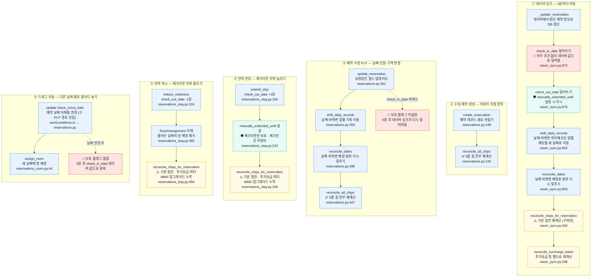
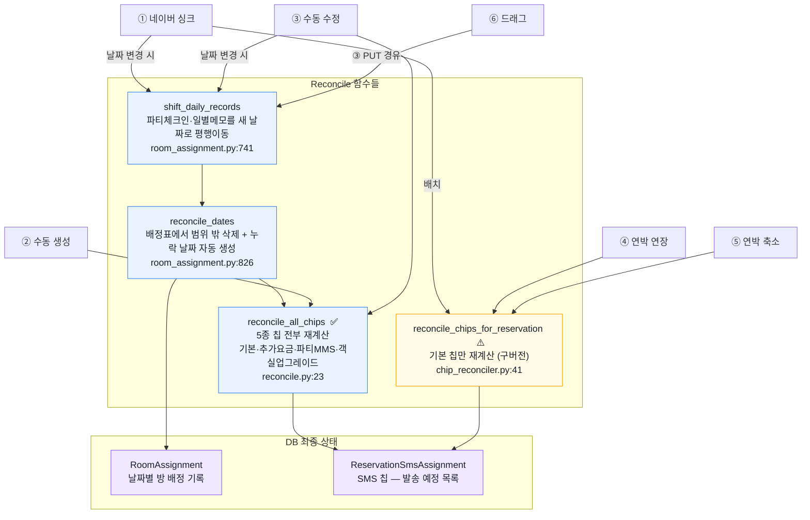
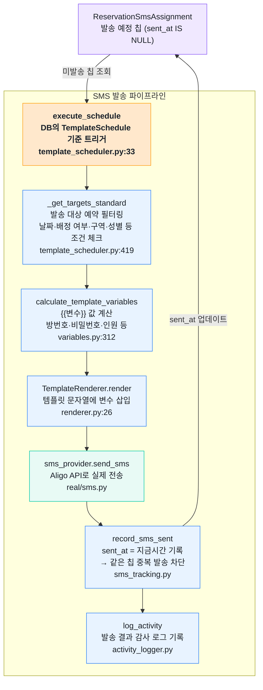
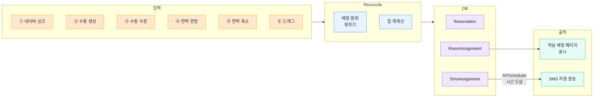

# 5. 예약 변경 전체 경로 — 6개 입력 → Reconcile → SMS 발송

예약 데이터가 바뀌는 모든 경로와, 그 후에 Reconcile·SMS 발송까지 이어지는 전체 흐름입니다.

> 🔴 버그 / 보호 없음 &nbsp;|&nbsp; ⚠️ 일부만 처리 &nbsp;|&nbsp; 🛡 보호 로직 있음 &nbsp;|&nbsp; ✅ 정상

---

## 6개 입력 경로

---

## Reconcile 레이어 — 예약 변경 후 데이터 정합성 맞추기

---

## SMS 발송 레이어 — APScheduler 시간 도달 시 자동 실행

---

## 전체 흐름 요약

